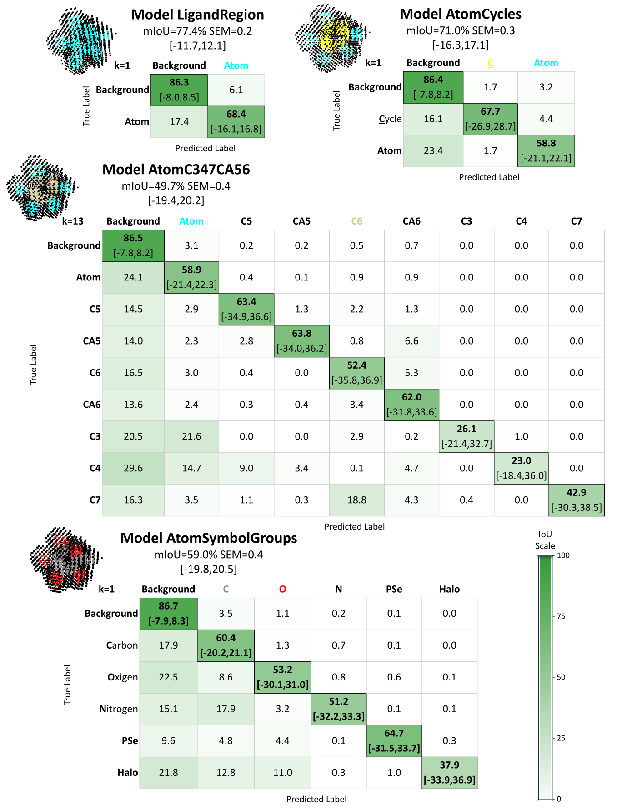

# NP³ DL Segmentation: A Deep Learning Pipeline for the Semantic Segmentation of LigPCDS

  This repository contains the code for training and validation of the DL models from LigPCDS (step 6 from part B and part C of the workflow presented in np3_LigPCDS).

  Four vocabularies were validated by training good performance DL models for the semantic 
segmentation of a stratified training dataset of LigPCDS. 
The average performance in the cross-validation of their best DL model is presented below using the mIoU, mF1, Precision and Recall metrics. Their bootstrap confidence intervals are presented between squared brackets. 

| DL Model         | dmax | Loss  weights | Epochs | Test mIoU | F1 score | Precision | Recall |
|------------------|------|---------------|--------|-----------|----------|-----------|--------|
| LigandRegion     | 1    | 1,2.5                     | 120    | 77.4 [-11.7,12.1]     | 87.0 [-8.4,8.8]     | 86.5  [-8.7,9.1]    | 87.4 [-7.8,8.2]  |
| AtomCycle        | 1.4  | 1,2.5,2.5                 | 120    | 71.0 [-16.3,17.1]     | 82.5 [-14.7,15.6]    | 80.5  [-13.7,14.5]    | 84.9 [-11.7,12.6]  |
| AtomC347CA56     | 865  | 1,10,5,5,50,5, 500,500,500 | 200    | 49.7 [-19.4,20.2]     | 62.4 [-18.8,19.7]    | 58.2 [-15.7,16.6]     | 74.1  [-14.9,15.8] |
| AtomSymbolGroups | 81.5 | 16,16,44,108,853          | 160    | 59.0 [-19.8,20.5]     | 73.1 [-19.6,20.3]    | 68.6  [-18.8,19.5]    | 79.5  [-15.4,16.2] |

--------------------------------------
## Confusion matrix of the validated modeling

  The confusion matrices presented in the image below contains the test IoU evaluation of the validated models (n=3035).
The rows of the confusion matrix represent the expected classes and the columns represent the predicted classes. 
The main diagonal of this matrix contains the IoU by class. The values of the confusion matrix are normalized by the
expected class (by row), where the total per class is the sum of its rows and columns. The confidence intervals by class are presented between squared brackets. 



<!--
#### Confusion matrix of model LigandRegion.

| K=1        | Background | Atom     |
|------------|------------|----------|
| Background | **86.3**   | 6.1      |
| Atom       | 17.4       | **68.4** |

#### Confusion matrix of model AtomCycle.

| k=1        | Background |    C     |   Atom   |
|------------|:----------:|:--------:|:--------:|
| Background |  **86.4**  |   1.7    |   3.2    |
| C          |    16.1    | **67.7** |   4.4    |
| Atom       |    23.4    |   1.7    | **58.8** |

#### Confusion matrix of model AtomC347CA56.

| k=13       | Background |   Atom   |    C5    |    CA5   |    C6    |    CA6   |    C3    |    C4    |    C7    |
|------------|:----------:|:--------:|:--------:|:--------:|:--------:|:--------:|:--------:|:--------:|:--------:|
| Background |  **86.5**  |    3.1   |    0.2   |    0.2   |    0.5   |    0.7   |    0.0   |    0.0   |    0.0   |
| Atom       |    24.1    | **58.9** |    0.4   |    0.1   |    0.9   |    0.9   |    0.0   |    0.0   |    0.0   |
| C5         |    14.5    |    2.9   | **63.4** |    1.3   |    2.2   |    1.3   |    0.0   |    0.0   |    0.0   |
| CA5        |    14.0    |    2.2   |    2.8   | **63.8** |    0.8   |    6.6   |    0.0   |    0.0   |    0.0   |
| C6         |    16.5    |    3.0   |    0.4   |    0.0   | **52.4** |    5.3   |    0.0   |    0.0   |    0.0   |
| CA6        |    13.6    |    2.4   |    0.3   |    0.4   |    3.4   | **62.0** |    0.0   |    0.0   |    0.0   |
| C3         |    20.3    |   21.3   |    0.0   |    0.0   |    3.0   |    0.2   | **26.3** |    1.0   |    0.0   |
| C4         |    25.0    |   12.2   |   11.3   |    2.8   |    0.1   |    3.9   |    0.0   | **26.6** |    0.0   |
| C7         |    17.4    |    2.7   |    0.8   |    0.2   |   18.9   |    5.9   |    0.6   |    0.0   | **42.1** |

#### Confusion matrix of model AtomSymbolGroups.

| k=1        | Background | C        | O        | N        | PSe      | Halo     |
|------------|------------|----------|----------|----------|----------|----------|
| Background |   **86.7** |      3.5 |      1.1 |      0.2 |      0.1 |      0.0 |
| C          |       17.9 | **60.4** |      1.3 |      0.7 |      0.1 |      0.0 |
| O          |       22.5 |      8.6 | **53.2** |      0.8 |      0.6 |      0.1 |
| N          |       15.1 |     17.9 |      3.2 | **51.2** |      0.1 |      0.1 |
| PSe        |        9.6 |      4.8 |      4.4 |      0.1 | **64.7** |      0.3 |
| Halo       |       21.6 |     13.1 |     11.1 |      0.2 |      1.0 | **37.6** |
-->

--------------------------------------------

### Best setup of the training pipeline 

  The values presented below were optimized in the systematic analysis for model AtomC347CA56. 
This setup was used to train all the validated models and was defined as the default value of each respective parameter. 
The name of the parameter of the training pipeline used to define each setup is also presented.

|            **Setup**            |           **Parameter**            |              **Value**             |
|:-------------------------------:|:----------------------------------:|:----------------------------------:|
|       Deep neural network       |              --model               |    MinkUNet34C_CONVATROUS_HYBRID   |
|        Ligand representation type        |             --pc_type              |             qRankMask_5            |
|            Optimizer            |            --optimizer             |                 SGD                |
|       Optimizer parameters      | --sgd_momentum and --sgd_dampening | momentum = 0.9 and dampening = 0.1 |
|          Learning rate          |                --lr                |                 2⁻⁸                |
|          Loss function          |            --loss_func             |                 wSL                |
|          Rotation rate          |          --rotation_rate           |                 50%                |
|         Total batch size        |     --batch_size and --num_gpu     |                 16                 |
| Number of gradient accumulation |            --iter_size             |                  1                 |
|        Normalization type       |              --model (depends on the model)              |                 BN                 |


---------------------------------------------

## How to train a DL model

The training pipeline was implemented in the 'main.py' script. To see the full list of parameters run:

`python main.py --help`

To see the list of mandatory parameters run:

`python main.py`

The following arguments are required:
> --ligs_data_filepath : This is the path to a training dataset containing the ligand entries to be used.

> --lig_pcds_path : This is the path to a LigPCDS dataset.

> --vocab_path : This is the path to the vocabulary used to label the provided dataset. The 'class_mapping_path' parameter must be informed to use a mapped vocabulary.

The output directory is defined with the following parameter:
> --log_dir : The output logging directory will be named as: "<log_dir>\_<'train'|'test'>_<pc_type>\_kfold\_\<kfold>\_model-\<model>\_<current_time>" 

To train a DL model, first the number of threads for multiprocessing parallelization must be set using the variable 'OMP_NUM_THREADS', following [Minkwoski Engine](https://github.com/NVIDIA/MinkowskiEngine) setup (example with 4 threads).
Then, the pipeline may be executed passing the desired parameters. 
The parameter `--resume` may be used to continue the training of a previous trained model. 

Example training model AtomC347CA56 in CPU using 2 devices with a small set of entries from the stratified training dataset from LigPCDS, data available in the 'test' folder.
This training example will be executed for 10 epochs, using a batch size and number of workers equals to 2 in train, validation and test, 
and with logging after every 4 steps for training and after 2 steps for validation and test.

Execute the following commands from this repository 'np3_DL_segmentation' folder:

```
conda activate np3_lig
export OMP_NUM_THREADS=4
python main.py --ligs_data_filepath /home/crisfbazz/Documents/CNPEM/np3_ligand/np3_DL_segmentation/test/LigPCDS_SP_1.5_2.2_gridspace_0.5_28022023_small_top_down_example/training_dataset_small_top_down_example_SP.csv --lig_pcds_path /home/crisfbazz/Documents/CNPEM/np3_ligand/np3_DL_segmentation/test/LigPCDS_SP_1.5_2.2_gridspace_0.5_28022023_small_top_down_example --vocab_path /home/crisfbazz/Documents/CNPEM/np3_ligand/np3_LigPCDS/vocabularies/SP-based/vocabulary_valid_ligands_PDB_1.5_2.2_SP-based.txt --class_mapping_path /home/crisfbazz/Documents/CNPEM/np3_ligand/np3_LigPCDS/vocabularies/SP-based/mapping_atomC347CA56.csv --is_cuda False --batch_size 2 --max_epoch 10 --log_freq 4 --val_freq 2 --log_dir test/outputs/out_train_LigPCDS_SP_1.5_2.2_gridspace_0.5_28022023_small_top_down_example --num_devices 2 --num_workers 2 --num_val_workers 2 --test_batch_size 2 --val_batch_size 2
```

This is only a small example to test the training pipeline, the model will not converge using this small sample dataset. Zeros (no convergence) and NaNs (missing classes) are expected in the result.

------------------------------------------
## How to test a DL model

  The parameter `--is_train` controls if the training pipeline will train (True) or test (False) a model.
And the parameter `--weights` is used to load a previous trained model for testing.

Example of testing the model AtomC347CA56 from LigPCDS available in the 'np3_blob_label' directory against the provided small example dataset, using k=13 (default `--kfold` parameter value - used in the model training):
```
export OMP_NUM_THREADS=4
python main.py --is_train False --ligs_data_filepath /home/crisfbazz/Documents/CNPEM/np3_ligand/np3_DL_segmentation/test/LigPCDS_SP_1.5_2.2_gridspace_0.5_28022023_small_top_down_example/training_dataset_small_top_down_example_SP.csv --lig_pcds_path /home/crisfbazz/Documents/CNPEM/np3_ligand/np3_DL_segmentation/test/LigPCDS_SP_1.5_2.2_gridspace_0.5_28022023_small_top_down_example/ --vocab_path ../np3_LigPCDS/vocabularies/SP-based/vocabulary_valid_ligands_PDB_1.5_2.2_SP-based.txt --class_mapping_path ../np3_LigPCDS/vocabularies/SP-based/mapping_atomC347CA56.csv --log_dir test/outputs/out_test_LigPCDS_SP_1.5_2.2_gridspace_0.5_28022023_small_top_down_example --test_batch_size 4 --kfold 13 --weights ../np3_blob_label/models/AtomC347CA56/modelAtomC347CA56_ligs-78911_img-qRankMask_5_gridspace-05_k13.ckpt --is_cuda False
```

A mIoU equals to 70.4% is expected in this sample testing.

#### Test and save the predictions

To save the predictions result of a testing, the parameters `--save_prediction` and `--save_pred_dir` must be defined together with `--test_batch_size 1`.

Example of testing a DL model and saving the predictions result of each test entry.

```
python main.py --is_train False --ligs_data_filepath /home/crisfbazz/Documents/CNPEM/np3_ligand/np3_DL_segmentation/test/LigPCDS_SP_1.5_2.2_gridspace_0.5_28022023_small_top_down_example/training_dataset_small_top_down_example_SP.csv --lig_pcds_path /home/crisfbazz/Documents/CNPEM/np3_ligand/np3_DL_segmentation/test/LigPCDS_SP_1.5_2.2_gridspace_0.5_28022023_small_top_down_example/ --vocab_path ../np3_LigPCDS/vocabularies/SP-based/vocabulary_valid_ligands_PDB_1.5_2.2_SP-based.txt --class_mapping_path ../np3_LigPCDS/vocabularies/SP-based/mapping_atomC347CA56.csv --log_dir test/outputs/out_test_LigPCDS_SP_1.5_2.2_gridspace_0.5_28022023_small_top_down_example --test_batch_size 1 --kfold 13 --weights ../np3_blob_label/models/AtomC347CA56/modelAtomC347CA56_ligs-78911_img-qRankMask_5_gridspace-05_k13.ckpt --is_cuda False --save_prediction True --save_pred_dir test/outputs/out_test_predictions_LigPCDS_SP_1.5_2.2_gridspace_0.5_28022023_small_top_down_example 
```

The prediction of the single test entry '4rvn_AMP_A_502' will be stored in the 
'test/outputs/out_test_predictions_LigPCDS_SP_1.5_2.2_gridspace_0.5_28022023_small_top_down_example' folder.
It contains two point clouds by test entry: one with the predicted class number (its order in the vocabulary) 
stored in its rgb channels and named with the suffix '_predicted.xyzrgb';
and another with the expected class number of each point (the target classes) in its rgb channels and 
named with the suffix '_target.xyzrgb'.

Additionally, two CSV tables are created to store the IoU ('entries_ious.csv') and F1 metrics ('entries_f1_recall_precision.csv') 
score by test entry and by class.

The visualization script is described below. 

-----------------------------------------------

## How to visualize the training curves

The visualization of the training curves of a training job is done with the [Tensorboad](https://www.tensorflow.org/tensorboard) platform.

Example:
```
tensorboard --logdir=<your_log_dir>
```

Then, open the url: http://localhost:6006/

-----------------------------------------------

## How to visualize the prediction results

The visualization of the predictions result, together with an error mask of each test entry, 
can be assessed with the following script:

```
python src/visualize_predictions.py test/outputs/out_test_predictions_LigPCDS_SP_1.5_2.2_gridspace_0.5_28022023_small_top_down_example
```

The error mask point cloud have the points with a wrong prediction colored in red and the rest in grey. 
The points predicted as Background class are removed in another representation (last column) to ease the visualization of the results.

Close the display to load the next prediction.

----------------------------

## Available data


- The validated DL models are presented in the np3_blob_label repository, inside the folder named as 'models'. It contains 4 subfolders, one for each validated modeling containing:
  - The trained models in .ckpt format
  - A metadata table describing more information about the training setup of the available DL models

#### LigPCDS records

The dataset created by LigPCDS and the validated models can be retrieved from [Zenodo](https://zenodo.org/), an open dissemination research data repository. The deposit data is located in the following ling [LigPCDS-Zenodo](https://zenodo.org/records/15174758), and contains:

- LigPCDS-SP_record : The dataset with the SP-based modeling representations in 3D point clouds, vocabulary, structure labeling result (xyz record) and validated DL models.
- LigPCDS-AtomSymbol_record : The dataset with the AtomSymbol-based modeling representations in 3D point clouds, vocabulary, structure labeling result (xyz record) and validated DL models.
- LigPCDS-Grids_reso-1.5-2.2_gridspace-0.5 : The dataset with the ligand grid representations in 3D point clouds of the list of valid ligands.


---------------------------------------------------------------

## Citing
Bazzano, C.F., Alves, L.F.G., Telles, G.P. et al. Labeled dataset of X-ray protein ligand images in 3D point cloud and validated deep learning models. Sci Data 12, 1726 (2025). https://doi.org/10.1038/s41597-025-06002-8
