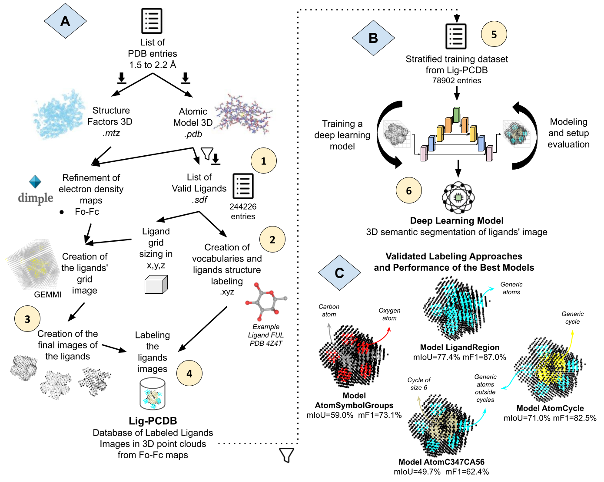

# NP³ Lig-PCDB: Labeled Databases of X-ray Ligands Images in 3D Point Clouds and Validated Deep Learning Models

This repository contains the code used to create the Lig-PCDB databases and the stratified training dataset (steps 1 to 5 from parts A and B of the workflow). 
The code for the models training pipeline and validation (step 6 from part B and part C of the workflow) is presented in the np3_DL_segmentation repository.

The workflow used to obtain Lig-PCDB, the deep learning models, and the validated labeling approaches is presented in the figure bellow.



###### _Modified images 'Machine Learning' by Srinivas Agra and 'intelligence' by Gacem Tachfin from Noun Project (CCBY3.0)._

##### Part A: Lig-PCDB creation schema 

In Step 1, a list of PDB entries from 1.5 to 2.2 Å was retrieved (.pdb and .mtz) and their free and organic ligands were filtered and validated (.sdf). It resulted in the list of valid ligands with 244226 entries. 

In Step 2, vocabularies of chemical classes were created and used for labeling atom-wise the structure of the valid ligands. They were based on the chemical atoms themselves and on cyclic substructures of the ligands. 

In Step 3, Dimple [ref] was used to refine the PDB entries and produced their Fo-Fc maps. Next, for each ligand, it was defined a grid sizing that covers its entire blob. Each ligand grid was interpolated from its Fo-Fc map to a 3D point cloud image and processed to create the final images of the ligands. 

Then, in Step 4 the labels of the structure of the ligands were extrapolated pointwise using an atomic sphere model for labeling the final images of the ligands. This resulted in Lig-PCDB. 

The viable modeling approaches are detailed bellow. It presents all viable vocabularies with their imbalance ratio in the list of valid ligands, their classes names and size.

| Vocabulary                        | dmax   | Classes                                        | Number of Classes |
|-----------------------------------|--------|------------------------------------------------|-------------------|
| Ligand Region                     | 1      | Background, Atom                               | 2                 |
| Generic Atoms and Cycles          | 2.1    | Background, Atom, C                            | 3                 |
| Generic Atoms and Cycles C347CA56 | 1535.2 | Background, Atom, C5, CA5, C6, CA6, C3, C4, C7 | 9                 |
| Atom Symbols with Groups          | 41.4   | Background, C, O, N, PSe, Halo                 | 6                 |


##### Part B: The general schema used to train and obtain the validated DL models. 

In step 5 a stratified training dataset was created from Lig-PCDB with n=78902 ligands entries, separated in k=13 similar groups.

In step 6 the Lig-PCDB entries of this dataset were used to train DL models in semantic segmentation tasks using Minkowski Engine [ref] architecture and its networks based on the 3D U-Net [ref]; cycles of training, evaluation and changes continued until good performance DL models were obtained. 

##### Part C: Validated labeling approaches. 

Four of the proposed labeling approaches were validated and are illustrated with ligand FUL from PDB entry 4Z4T. 
The average performance in the cross-validation of their best DL model is presented below using the mIoU, mF1, Precision and Recall metrics. 

| DL Model          | dmax | Loss  weights             | Epochs | Test mIoU | F1 score | Precision | Recall |
|-------------------|------|---------------------------|--------|-----------|----------|-----------|--------|
| LigandRegion      | 1    | 1,2.5                     | 120    | 77.4      | 87.0     | 86.5      | 87.4   |
| AtomCycle         | 1.4  | 1,2.5,2.5                 | 120    | 71.0      | 82.5     | 80.5      | 84.9   |
| Atom C347CA56     | 865  | 1,10,5,5,50,5,500,500,500 | 200    | 49.7      | 62.4     | 58.2      | 74.1   |
| AtomSymbol Groups | 81.5 | 16,16,44,108,853          | 160    | 59.0      | 73.1     | 68.6      | 79.5   |

----------------------------

## Available data


- Two PDB report tables downloaded in July 2019, located inside the PDB_lists folder:
  - _PDB_entries_hasLigand_structureFactors_xray_protein.csv_ : list of PDB entries and the ligands codes they have 
  - _Ligands_PDB_entries_hasLigand_structureFactors_xray_protein.csv_ : list of ligands codes, types and PDB entry in which it appears
- List of valid ligands: located inside the 'PDB_lists/valid_ligands_list' folder in zip format:
  - _valid_ligands_list_PDB_1.5_2.2_NP_atoms_free_ligands_1_counts_2008-02-01_depDate_noQualityFilter_box_class_freq_qRankTested_0.5_AtomSymbol.zip_ : the valid ligands list labeled with the Atom-based approach
  - _valid_ligands_list_PDB_1.5_2.2_NP_atoms_free_ligands_1_counts_2008-02-01_depDate_noQualityFilter_box_class_freq_qRankTested_0.5_SP.zip_ : the valid ligands list labeled with the SP-base approach
  - _valid_ligands_list_columns_description.csv_ : a table describing the columns of the tables with the list of valid ligands
- The proposed vocabularies and mappings for the viable labeling approaches, located in the 'vocabularies' folder:
  - AtomSymbol-based : a folder with the AtomSymbol-based vocabulary (.txt) and mapping tables (.csv)
  - SP-based : a folder with the SP-based vocabulary (.txt) and mapping tables (.csv)
- A table with the atomic radii from theoretical and experimental data, located in the root folder:
  - _atomic_radii_tables.csv_

#### Lig-PCDB databases record

The databases created by Lig-PCDB can be retrieved from [Zenodo](https://zenodo.org/), an open dissemination research data repository. The deposit data is located in the record xTODOlinkX, and contains:

- Lig-PCDB-SP_record : The database with the SP-based modeling images, vocabulary, structure labeling result (xyz record) and DL models.
- Lig-PCDB-AtomSymbol_record : The database with the AtomSymbol-based modeling images, vocabulary, structure labeling result (xyz record) and DL models.
- Lig-PCDB-Grids_reso-1.5-2.2_gridspace-0.5 : The database with the ligand grid image of the valid ligands list.

---------------------------
---------------------------

## How to use

The scripts used in each step from 1 to 5 are detailed below in separated subsections.
This corresponds to parts A and B from the workflow to create the Lig-PCDB databases and the stratified training dataset. 
 
At the end there is also some visualization scripts and an additional testing script.

### Step 1

--------------------

#### 1.1 Download PDB List (Manual) 

Manually download two report lists from the PDB website using the following filters:
- Resolution between 1.5 Å and 2.5 Å
- With free ligands (non-covalent)
- With experimental data (with electron density maps also deposited)
- From X-ray experiments with proteins

The PDB lists downloaded for Lig-PCDB were retrieved in July 2019 and are present in the PDB_lists folder, named as:
- PDB report list: _PDB_entries_hasLigand_structureFactors_xray_protein.csv_
  - List of PDB entries and the ligands codes they have. It must contain the PDB IDs entries, with two mandatory columns: 'PDBID', 'Resolution'
- Ligand report list: _Ligands_PDB_entries_hasLigand_structureFactors_xray_protein.csv_ 
  - List of ligands codes, type (free or covalent) and PDB entry in which it appears. It must contain the ligand's entries information (e.g. ligand code, molecular formula) and the PDB IDs in which each ligand entry appears (counts). With the following mandatory columns (spaces are removed): LigandID, LigandFormula, PDBIDsTotal, PDBIDsFreeLigand, InstancePDBIDsasFreeLigand, InstancePDBIDsAll.

#### 1.2 Filter PDB List   

Filter the PDB report lists using as criteria the PDB entries resolution, a list of organic atoms (natural products filter), the deposit date of the PDB entries and the ligand's counts by PDB entry.
These report files must follow the table format exported by PDB in july 2019. 

*Run:*

> ``` Rscript src/filter_pdb_ligs_entries.R pdb_report ligand_report min_pdbids resolution_min resolution_max np_filter deposit_date_min```

*Parameters:*

   1. pdb_report: Path to the PDB report list - CSV table containing the PDB entries information, mandatory columns (spaces are removed): PDBID, Resolution;
   2. ligand_report: Path to the Ligand report list - CSV table containing the ligands entries and their counts by code and PDB entry, with the following mandatory columns (spaces are removed): LigandID, LigandFormula, PDBIDsTotal, PDBIDsFreeLigand, InstancePDBIDsasFreeLigand, InstancePDBIDsAll;
      * Only the Free ligands are used (InstancePDBIDsasFreeLigand), the polymeric ligands are ignored;
   3. min_pdbids: Minimum number of PDB entries (IDs) in which a ligand must be present to be included in the resulting list of entries;
   4. resolution_min: Minimum resolution of a PDB entry to be included in the resulting list;
   5. resolution_max: Maximum resolution of a PDB entry to be included in the resulting list;
   6. np_filter: TRUE or FALSE to apply the natural products filter and only retain ligands that have the following organic atoms: C,H,O,N,P,S,I,Br,Cl,F,Se;
   7. deposit_date_min: The minimum deposit date that a PDB entry must have to be included in the resulting list (default to no deposit date filter). All filtered entries must have been deposited after or in this date. The informed date must follow the format yyyy-mm-dd, as in 2008-01-01, where yyyy is the year, mm is the month and dd is the day.

*Return:*

Two CSV files with the filtered lists and with the ligands aggregated by PDBID. The files will saved to the current directory and be named as follows:

    - PDB_<min_resolution>_<max_resolution>_<all|CHONPSIBrClF>_atoms_free_ligands_<min_count>_counts_<deposit_data_fitler>_depDate.csv
    - ligands_free_PDB_<min_resolution>_<max_resolution>_<all|CHONPSIBrClFSe>_atoms_<min_count>_counts_<deposit_data_fitler>_depDate.csv

*Example:*

> ``` Rscript src/filter_pdb_ligs_entries.R PDB_lists/PDB_entries_structure_factors_xray_protein.csv PDB_lists/Ligands_PDB_entries_structure_factors_xray_protein.csv 1 1.5 2.2 TRUE 2008-02-01```

#### **1.3 Download PDB Entries + Ligands Data** 

Retrieve the data from the PDB IDs and the ligands present in the provided filtered PDB list.
This data will enable the refinement of the entries with and without the ligands structure.

This code was intended to work with PDB APIs from July 2019. Any updates in PDB API must be updated in the code.
  
*Run:*

> ``` python src/run_fetch_entries.py db_path pdb_report_entries_filtered row_entry_start row_entry_stop ```

*Parameters:*

    1. db_path: The path to the data folder where the data will be stored. If missing it will be recursively created.
    2. pdb_report_entries_filtered: The path to the CSV file outputed by the filter_pdb_ligs_entries script containing the PDB IDs of the entries and the ligands of each entry to be retrieved. Mandatory columns = 'PDBID' and 'ligandsID'. The column 'ligandsID' must have the names separated by a space of all the desired ligands present in the structure with code equals 'PDBID'.
    3. row_entry_start: (default: 0)The number of the row of the entries CSV file where the script should start. Skip to the given row or, if missing, start from the beginning.
    4. row_entry_stop: (default: number of rows in the pdb_report_entries_filtered) The number of the row of the ligands CSV file where the script should stop. Stop in the given row or, if missing, stop in the last row.
  
*Return:*

The db_path folder is created and inside it four subfolders are created: 

    - 'pdb' to store the entries .pdb files; 
    - 'coefficients' to store the entries .mtz files; 
    - 'ligands' to store the ligands .sdf and the .pdb files;  
    - 'pdb_no_lig' to store the entries .pdb files without each ligand coordinate.

*Example:*

> ``` python src/run_fetch_entries.py data/ PDB_1.5_2.2_NP_atoms_free_ligands_1_counts_2008-02-01_depDate.csv```

#### 1.4 List of Available Ligands

The list of available ligands contains the entries that were retrieved (download ok) and have a valid SDF file.

This step will check if the SDF files of the retrieved ligands (ligands_data_folder) are valid and will add the information of the valid entries to the list of available ligands.
If the SDF file of a ligand entry can be parsed by rdkit [ref] and results in a valid molecular graph, then this ligand's file is valid. Otherwise it is removed from the resulting list.

*Run:*

> ``` python src/list_valid_sdf_ligands_and_info.py ligands_data_folder```

*Parameters:*

    1. ligands_data_folder: The path to the data folder where the SDF files of the retrieved ligands are located.
   
*Return:*
        
One table will be created in the current directory named: 
    
    - db_ligand_path.name+'_valid_sdf_info.csv' : containing the list of available ligands with a valid SDF file and their information.

*Example:*

> ``` python src/list_valid_sdf_ligands_and_info.py data/ligands```


#### 1.5 Quality filters in the PDB and in the Available Ligands lists 

Filter the free ligands and apply global quality filters (parameters) to all PDB and available ligand entries present in the provided lists.

*Run:*

``` 
python src/quality_filter_pdb_ligands_lists.py pdb_list_file db_path ligands_list_file bfactor_ratio bfactor_std occupancy_cutoff allow_missingHeavyAtoms num_disordered_cutoff 
```

*Parameters:*

    1. pdb_list_file: The path to the CSV file containing the list of filtered PDB entries. Mandatory columns = 'PDBID', 'Resolution', 'SpaceGroup', 'AverageBFactor', 'ligandsID';
    2. db_path: The path to the data folder where the directories 'pdb' and 'coefficients' are located;
    3. ligands_list_file: The path to the CSV file containing the list of available ligands with a valid sdf file and their info. Mandatory columns: ligID, entry, ligCode, bfactor, min_occupancy, missingHeavyAtoms, numDisordered;
    4. bfactor_ratio: The maximum allowed bfactor ratio between a ligand bfactor and its PDB entry bfactor;
    5. bfactor_std: The maximum allowed bfactor standard deviation between the ligand atom's bfactor;
    6. occupancy_cutoff: The minimum occupancy cutoff to keep a ligand;
    7. allow_missingHeavyAtoms: The missingHeavyAtoms boolean TRUE (1) or FALSE (0) to allow missing heavy atoms in the ligands. If FALSE, no ligands entries with missing heavy atoms will be allowed;
    8. num_disordered_cutoff: The maximum numDisordered that a ligand entry is allowed to have. 

*Return:*

Two tables will be created in the current directory:
   
    - '<pdb_list_file.name>_filter_bfactor_<bfactor_ratio>_occ_<occupancy_cutoff>_missHAtoms_<allow_missingHeavyAtoms>_numDisorder_<num_disordered_cutoff>.csv' : containing the filtered pdb entries that passed the quality criteria;
    - '<ligands_list_file.name>_filter_bfactor_<bfactor_ratio>_occ_<occupancy_cutoff>_missHAtoms_<allow_missingHeavyAtoms>_numDisorder_<num_disordered_cutoff>.csv' : containing the ligands that passed the quality criteria. ligands_valid_sdf_info.csv

*Example:*

Do not apply the quality filters related to bfactor, occupancy and disorder.
> ``` python src/quality_filter_pdb_ligands_lists.py PDB_1.5_2.2_NP_atoms_free_ligands_1_counts_2008-02-01_depDate.csv data/ ligands_valid_sdf_info.csv 10000 10000 0 TRUE 0 10000```

### Step 2

--------------------

#### 2.1 Vocabulary Creation and Ligands Structure Labeling 

Create a vocabulary from the list of valid ligands that passed the quality filter and label the ligands structure. 

The smiles of each ligand will be used to extract all the classes necessary to label the list of valid ligands. The unique list of classes will compose the new vocabulary.
Then, it will get each ligand SDF file and use the new vocabulary to label the ligands' atoms. Finally, for each ligand its structure labeling result will be exported to a .xyz file, containing the class of each atom by row. 
Also computes the sizing of the ligand grid, a minimum bounding box around the ligand atomic positions (minimum and maximum position in xyz) plus a gap in all axis equal to 4.2 Angstrons and centered in the atomic positions center value. 

The vocabulary can be based on: the atoms' SP hybridization concatenated with cyclic information or the atoms' symbols concatenated with cyclic information. The user must choose one of the labeling approaches using the parameter 'label_SP'.

During the ligands SDF file labeling a reverse engineering testing is applied. It tests the ligands labels from their SDF files against their predicted labels using the ligands smiles. If a ligand have missing atoms in its SDF file, then try to match only the present substructure. 
Ligands with mismatching labels in this test are removed. Ligands with bad defined SDF files, that raises an error when reading them are also removed here.

*Run:*

> ``` python src/run_vocabulary_encode_ligands.py data_folder_path ligands_list_path label_SP row_start row_end ```

*Parameters:*

1. data_folder_path: The path to the data folder where the vocabulary output will be stored and where the 'ligands' folder with the ligands in .sdf format is located.
2. ligands_list_path: The path to the CSV file containing the valid ligands list and their smiles. This file is expected to be the output of the quality filter script. Mandatory columns = 'ligID','smiles'.
The name of this file will be used to label the output vocabulary file, the ligands SMILES database file and the xyz folder that will store the labeled ligands .xyz files;
3. label_SP: (optional) Set to 'True' to use the atoms' SP hybridization to create the vocabulary (default), otherwise it will use the atoms' symbol. Both labeling approaches will be concatenated with the atoms' cyclic information.
4. row_start: (optional) The number of the row in the ligands_list_path file where the script should start. Skip to the given row or, if missing, start from the beginning;
5. row_end: (optional) The number of the row in the ligands_list_path file where the script should stop. Stop in the given row or, if missing, stop in the last row.

*Return:*

Two files will be created inside the data_folder_path directory:
   - 'ligs_smiles_<ligands_list_path.name>.txt' containing all the smiles used in the vocabulary creation (the smiles database) and;
   - 'vocabulary_<ligands_list_path.name>.txt' containing all the classes that resulted from the smiles labeling, with one class by row (the vocabulary itself). The rows order indicate the index of the vocabulary classes, starting in 0.

And one folder called 'xyz_<ligands_list_path>' will be created inside the "<data_folder_path>/ligands" folder to store the labeled structure of the ligands, it will contain:
   - One .xyz file for each successfully labeled ligand structure present in the ligands_list_path file, containing the ligands' atoms by row with their information and label;
   - One CSV file named '<ligands_list_path>_box_class_freq.csv' containing the list of valid ligands that had their structure successfully labeled, plus their bounding box sizing and vocabulary classes frequency (number of labeled atoms by class);
        - The column 'filter_quality' equals to TRUE indicate the successfully labeled entries; and when it is equal to FALSE, indicate ligands entries that raised an error in this step. This column may be used to filter the list of successfully labeled entries.

*Example:*

SP-based structure labeling.
> ``` python src/run_vocabulary_encode_ligands.py data/ ligands_valid_sdf_info_filter_bfactor_10000_occ_10000_missHAtoms_TRUE_numDisorder_10000.csv True```

Atom-based structure labeling.
> ``` python src/run_vocabulary_encode_ligands.py data/ ligands_valid_sdf_info_filter_bfactor_10000_occ_10000_missHAtoms_TRUE_numDisorder_10000.csv False```


### Steps 3 and 4

----------------------

Ligands' image creation and labeling.

#### 3.1 Refinement

Execute Dimple to refine the retrieved entries present in a list. A 2x slow refinement is performed and without hetero atoms (hetatm removed). 
This allows the blob of ligands to appear in their calculated Fo-Fc map.

This is a slow step. At least 10 minutes is expected for the refinement of each entry in a personal computer.

*Run:*

> ``` python src/refinement_dimple.py data_folder_path pdb_list_path num_parallel overwrite```

*Parameters:*

1. data_folder_path: The path to the data folder where the 'pdb' and the 'coefficients' folders are located, containing the files of the PDB entries named as 'pdb<PDBID>.ent' and '<PDBID>.mtz', respectively. A folder named 'refinement' will be created inside the data_folder_path to store the Dimple results in separated subfolders by PDB entry.
2. pdb_list_path: The path to a CSV table with the PDB list to be refined. Mandatory column: 'PDBID' with the PDB entries IDs (they will be converted to lower case).
3. num_parallel: (optional) The number of processors to use for multiprocessing parallelization (default to 2);
4. overwrite: (optional) A boolean True or False indicating if the already refined entries should be overwritten (True) or skipped (False). Default to False.

*Output:*

A folder named 'refinement' will be created inside the data_folder_path to store the Dimple results in separated subfolders by PDB entry.

If overwrite is False, it will skip the already refined entries and continue from the last not refined entry.

*Example:*

> ``` python src/refinement_dimple.py data/ PDB_1.5_2.2_NP_atoms_free_ligands_1_counts_2008-02-01_depDate_filter_bfactor_10000_occ_10000_missHAtoms_TRUE_numDisorder_10000.csv 10```


#### 3.2 Ligand Grid Image Creation 

Create the ligand grid image for all ligands entries that had their structure successfully labeled and refined.

For each ligand entry, it reads the respective PDB entry Fo-Fc map from the refined MTZ file (parameter refinement_path); 
and the ligand atomic positions from the ligand's structure label file .xyz (parameter xyz_labels_path). 
Then, it extracts the ligand grid image from the refined Fo-Fc map of its PDB entry, 
located inside a bounding box around its atomic positions plus a gap and using a grid spacing equal to 0.5 by default (parameter grid_space). 
And finally, the image will be stored in a point cloud file inside the subfolder of each PDB entry in the output path (parameter output_grid_path).

*Run:*

> ``` python src/mtz_to_grid_pointcloud.py xyz_labels_path refinement_path output_grid_path overwrite num_parallel grid_space```

*Parameters:*

1. xyz_labels_path: The path to the data folder called 'ligands/xyz_<valid ligand list csv name>' where the ligands .xyz files with their atomic positions and structure labels are located. It must also contain the CSV file with the valid ligands list and their grid sizing and position. This file must be named as '<valid ligand list csv name>_box_class_freq.csv' and is expected to be the output of the 'run_vocabulary_encode_ligands.py' script. Mandatory columns = 'ligID', 'ligCode', 'entry', 'filter_quality', 'x', 'y', 'z', 'x_bound', 'y_bound','z_bound'.;
2. refinement_path: The path to the data folder where the entries refinement are located ('data/refinement').
3. output_grid_path: The path to the output folder where the point cloud of the ligands' grid image will be stored in .xyzrgb files. It will be organized by the PDB entry ID of the ligands in separated subfolders, each one containing the grid image of all ligands that appear in that entry ('data/ligands_grid_point_clouds');
4. overwrite: (optional) A boolean True or False indicating if the already processed ligands should be overwritten. Useful to restart from previous processing. (Default to False).
5. num_parallel: (optional) The number of processors to use for multiprocessing parallelization (Default to 2).
6. grid_space: (optional) A numeric defining the grid spacing size in angstroms to be used in the point clouds creation for the ligands' grid image (Default to 0.5 A).

*Output*

The output_grid_path folder will be created with one subfolder for each PDB entry of the ligands that had their grid image successfully created:
- The subfolder of each PDB entry will contain the grid image of all ligands (.xyzrgb files) that appear in the respective entry and that were successful in their grid image creation.

One file will be created inside the xyz_labels_path directory:
- One CSV file named '\<valid ligand list csv name\>_box_pc.csv' containing the list of valid ligands that had their grid image successfully created. 
It will also add columns with the electron density descriptive statistics of the grid of each ligand (mean value, standard deviation and others).

*Example:*

> ``` python src/mtz_to_grid_pointcloud.py data/ligands/xyz_ligands_valid_sdf_info_filter_bfactor_10000_occ_10000_missHAtoms_TRUE_numDisorder_10000_SP data/refinement/ data/ligs_point_cloud_grid True 10 0.5```

#### 3.3 Ligands Image Creation and Labeling (Step 4)** 

Create the final images of the ligands in quantile rank scale and also create their labeling files for each image type.

For each ligand entry that had its ligand grid image successfully created, it will extract the ligand mask image and 
then create the final images of the ligands. The following image types will be created: 
qRank0.5, qRank0.7, qRank0.75, qRank0.8, qRank0.85, qRank0.9, qRank0.95, qRankMask, and qRankMask_5.
At the end, the final images will be stored in a point cloud file inside the subfolder of each ligand's PDB entry 
in the output path (parameter output_LigPCDB_path).

*Run:*

> ``` python src/grid_pointcloud_to_quantile_rank_scale.py xyz_labels_path output_grid_path output_ligPCDB_path num_parallel overwrite row_start row_end```

*Parameters:*

1. xyz_labels_path: The path to the data folder called 'xyz_<valid ligand list csv name>' where the ligands .xyz files with their labels are located. It must also contain the CSV file with the valid ligands list that had the ligand grid image successfully created. This file is named as '<valid ligand list csv name>_box_pc.csv' and is expected to be the output of the mtz_to_grid_pointcloud.py script. Mandatory columns = 'ligID', 'ligCode', 'entry';
2. output_grid_path: The path to the folder where the ligands grid image in point clouds are stored ('data/lig_point_clouds_grids');
3. output_ligPCDB_path: The path to the output folder where the point clouds of the final images of the ligands in quantile rank scale will be stored ('data/lig_pcdb' or other);
4. num_parallel: (optional) The number of processors to use for multiprocessing parallelization (Default to 2);
5. overwrite: (optional) A boolean True or False indicating if the already processed ligands should be overwritten (Default to False);
6. row_start: (optional) The number of the row of the '<valid ligand list csv name>_box_pc.csv' file where the script should start. Skip to the given row or, if missing, start from the beginning;
7. row_end: (optional) The number of the row of the '<valid ligand list csv name>_box_pc.csv' file where the script should stop. Stop in the given row or, if missing, equal to zero or greater than the number of rows, stop in the last row.

*Output:*

The output_ligPCDB_path folder will be created with one subfolder for each PDB entry of the ligands that had all their final images successfully created and labeled:
- The subfolder of each PDB entry will contain the final images of all ligands (.xyzrgb files) that appear in the respective entry and that were successfull in all image types creation.

One file will be created inside the xyz_labels_path directory:
- One CSV file named '\<valid ligand list csv name\>_box_class_freq_qRank_scale.csv' containing the list of valid ligands that had their final images successufully created. 
It will also add columns with the size of the final images of the ligands by image type. 
The size of these images is equal to the number of points in the point cloud image of each image type.

*Example:*

> ``` python src/grid_pointcloud_to_quantile_rank_scale.py data/ligands/xyz_ligands_valid_sdf_info_filter_bfactor_10000_occ_10000_missHAtoms_TRUE_numDisorder_10000_SP data/ligs_point_cloud_grid data/ligs_pcdb_SP 10```

#### 3.4 Ligands Image Labeling Test 

Tests the labels of the ligands images against their expected labels from their structure labeling (in .xyz files from their SDF files). 
It will check for each atom of a ligand if the points around it and inside 1/4 of its atomic sphere have all the same label equals to the expected label from its structure labeling result (.xyz file).
For each image type, it also computes two metrics: the percentage of points in the background class; 
and the average percentage of covered points by the atomic sphere of the ligands' atoms (number of points present inside each atom's atomic sphere / expected number of points that fits in each atom's atomic sphere).
A low percentage of atom coverage may indicate low quality images. The opposite may also be true or noise.
  
If draw_pc is enabled, it will draw the ligands images being tested and will color the final images using the valid labels.

*Run:*

> ``` python test/test_ligands_pointcloud_label_qRankScale.py xyz_folder_path output_ligPCDB_path num_parallel draw_pc```

*Parameters:*

 1. xyz_labels_path: The path to the data folder called 'ligands/xyz_<valid ligand list csv name>' where the ligands .xyz files with their atomic positions and structure labels are located. It must also contain the CSV file with the valid ligands list and their grid sizing and position. This file is named as '<valid ligand list csv name>_box_class_freq.csv' and is expected to be the output of the 'run_vocabulary_encode_ligands.py' script. Mandatory columns = 'ligID', 'ligCode', 'entry', 'filter_quality', 'x', 'y', 'z', 'x_bound', 'y_bound','z_bound';
 2. output_ligPCDB_path: The path to the data folder where the point clouds of the final images of the ligands in quantile rank scale are be stored ('data/lig_pcdb' or other);
 3. num_parallel: (optional) The number of processors to use for multiprocessing parallelization (default to 2);
 4. draw_pc: (optional) Boolean True or False to draw the images point clouds. If True, enable drawing the final images of the ligands and color them using their labels. If False, do not draw the images (default to False).

*Output:*

One file is created inside the xyz_labels_path folder:
- One CSV file named '<valid ligand list csv name>_box_class_freq_qRankTested.csv' containing the **list of valid ligands** that had their final images successfully created and tested.
This table also signalizes any found error or missing data, and contains the values of the computed metrics by image type;

It will print to the screen the inconsistencies found for each valid ligand in the xyz_folder_path folder.

*Example:*

> ``` python test/test_ligands_pointcloud_label_qRankScale.py data/ligands/xyz_ligands_valid_sdf_info_filter_bfactor_10000_occ_10000_missHAtoms_TRUE_numDisorder_10000_SP data/ligs_pcdb_SP 4 False```

### Step 5

-------------------------------

Creation of a stratified training dataset from a list of valid ligands. 
This dataset is intended to be used in the training pipeline of the DL semantic segmentation task (np3_DL_segmentation repository).

#### 5.1 Undersampling in Lig-PCDB

Applies an undersampling technique in a list of valid ligands (provided dataset). It will filter the ligands entries using their occurrence by selected class of the given vocabulary and by ligand code (unique structure).
An anti-clustering algorithm is used in the undersampling approach to keep diversity among the filtered entries related to their occurrence by class, size of the qRank0.95 image, B factor, resolution and occupancy.

This step is intended to remove bias in the list of valid ligands towards frequent ligand codes and frequent classes. It also removes entries with a small number of points of less than 150 in its qRank0.95 image.

*Run:*

> ``` Rscript src/undersampling_by_class_occurence.R valid_ligands_list_path vocab_path classes_list max_ligCode_occ min_class_occ max_class_occ```

*Parameters:*

1. valid_ligands_list_path: Path to the CSV table with the list of valid ligands. The undersampling technique will be applied in this list to filter the ligands entries (rows), it will remove bias towards frequent ligand codes and frequent classes. Mandatory columns: ligCode, entry, bfactor, AverageBFactor, Resolution, point_cloud_size_qRank0.95, and '0' to the number of classes in the vocabulary minus one;
2. vocab_path: Path to the vocabulary file used to label the ligands entries present in the valid_ligands_list_path table. It must contain one label by row, defining their order (the Background class is not used);
3. classes_list: The list of classes of the vocabulary that will be used in the undersampling of the entries by the anti-clustering algorithm (stratified approach). The names of the selected classes separated by comma or the word 'all' to use the entire vocabulary (all the classes). Only the ligands that were labeled with this list of classes will be kept, the rest will be filtered out;
4. max_ligCode_occ: The maximum number of ligand entries occurrences by ligCode - balance the occurrence of different ligands structures in the dataset;
5. min_class_occ: The minimum number of classes occurrences by ligand entry (minimum number of entries in which the class appear);
6. max_class_occ: The maximum number of classes occurrences by ligand entry (maximum number of entries in which the class appear)

*Output:*

One file is created in the same directory of the valid_ligands_list_path:
- One CSV file named '<valid_ligands_list_path.name>_undersampling_<classes_list>_maxLigCode_<max_ligCode_occ>_classOcc_<min_class_occ>_<max_class_occ>.csv' containing the filtered list of valid ligands that were kept by the undersampling technique.

It will print to the screen the occurrences of the vocabulary classes by ligand entry and by labeled atom. 
The user may analyse this values to accept the result or plan a new undersampling job.

*Example:*

Limit the ligands' code frequency to 1000 repetitions and do not limit the classes occurrence:
> ``` Rscript src/undersampling_by_class_occurence.R valid_ligands_list_PDB_1.5_2.2_NP_atoms_free_ligands_1_counts_2008-02-01_depDate_noQualityFilter_box_class_freq_qRankTested_0.5_SP.csv vocabularies/SP-based/vocabulary_valid_ligands_PDB_1.5_2.2_SP-based.txt all 1000 0 1000000```

#### 5.2 Stratified k-fold cross validation

Applies the k-fold cross validation technique to separate a list of valid ligands in k similar groups for train, test and validation subsets. It is intended to be executed after the undersampling technique.
Each k group will be separated in other two groups related to test and validation subsets.

It uses an anti-clustering algorithm to perform a stratified separation that keeps a diversity of ligands entries related to their following characteristics: classes occurrence, ligCode, PDB entry, bfactors, resolution and size of the ligand mask image (point_cloud_size_qRankMask).

*Run:*

> ``` Rscript src/split_ligs_dataset_kfold.R valid_ligands_list_path vocab_path k classes_list```

*Parameters:*

1. valid_ligands_list_path: Path to the CSV table with the list of valid ligands to be stratified with a k-fold cross validation approach. Mandatory columns: ligCode, entry, bfactor, AverageBFactor, Resolution, point_cloud_size_qRankMask, 0 to the number of classes - 1;
2. vocab_path: Path to the vocabulary file used to label the ligands entries present in the valid_ligands_list_path table. It must contain one label by row, defining their order (the Background class is not used);
3. k: The number of anti-clusters (groups with high diversity) to be created. This is the number of k-folds. Each k group will be separated in another two similar groups;
4. classes_list: (optional) The list of classes of the vocabulary that will be used in the separation of the entries by the anti-clustering algorithm (stratified approach). The names of the selected classes separated by comma or the word 'all' to use the entire vocabulary (all the classes). Default to 'all'.

*Output:*

One file is created in the same directory of the valid_ligands_list_path:
- One CSV file named '<valid_ligands_list_path.name>_split_<classes_list>_kfolds_<k>.csv' containing the list of valid ligands separated in k similar groups.
  - The groups are defined by the column 'kfolds' which contains values from 1 to k; and by the column 'test_val' which contains values equal to 'test' or 'val'.

It will print to the screen the average value of the selected numeric characteristics by k group. Similar values should be present within the k groups.

*Example:*

Separate the ligands entries in k=13 similar groups:
> ``` Rscript src/undersampling_by_class_occurence.R valid_ligands_list_PDB_1.5_2.2_NP_atoms_free_ligands_1_counts_2008-02-01_depDate_noQualityFilter_box_class_freq_qRankTested_0.5_SP_undersampling_maxLigCode_1000.csv vocabularies/SP-based/vocabulary_valid_ligands_PDB_1.5_2.2_SP-based.txt 13```

-------------------------------
-------------------------------

### Visualize Lig-PCDB

The visualization script will render, for each ligand ID present in the database (user provided: list_ligands_path and lig-pcdb_path):
- The 3D point clouds of its images, further colored by the points' feature value and for each image type selected by the user (img_types). 
  - The image types are separated by columns in the x-axis, with a distance equal to 2 times its x-axis size of the image. 
- If the vocabulary is informed, the images are rendered in another row colored by the labeled class of each point from the ligands' label files (user provided: vocab_path). 
  - The rows are translated in the z-axis by 3 times the z-axis size of the image. 
- If the predictions directory is informed, the images are also rendered in another row colored by the predicted class of each point from the prediction result (user provided: predictions_path).
  - The rows are translated in the z-axis by 6 times the z-axis size of the image. 
  - 
The visualization script opens a new window that contains a 3D display in xyz space of the Open3d Python package. 
This display allows to zoom, translate and rotate the images and point size scaling. 
The user can register the nice poses by taking pictures of the display 
(more information on this display capabilities in: [link](http://www.open3d.org/docs/latest/tutorial/Basic/visualization.html)).

*Run:*

> ``` python src/visualize_lig-pcdb.py list_ligands_path lig-pcdb_path img_types vocab_path class_mapping_path predictions_path```

*Parameters:*

1. list_ligands_path: A table with a list of ligands in CSV format containing the ligID column with the ligands' ID that you want to visualize from the database;
2. lig-pcdb_path: The path to the database folder where the ligands' images in point clouds are located;
3. img_types: The images types that you want to visualize, separated by comma and without spaces (e.g. qRankMask_5,qRank0.95,qRank0.5);
4. vocab_path: (optional) The path to the vocabulary file used to label the database. Default to 'none' - won't draw the ligands images colored by the labels;
5. class_mapping_path: (optional) The path to a class mapping file in CSV format or 'none'. Default to 'none';
6. predictions_path: (optional) The path to a directory with the predictions result coming from the np3_DL_segmentation module and organized in subfolders, one for each PDB entry that appear in the ligands' list table, or 'none'. Default to 'none'.

*Example:*

Visualize the images from the valid ligands list present in the Lig-PCDB-SP and color them with their expected labels from model AtomC347CA56:
> ``` python src/visualize_lig-pcdb.py PDB_lists/valid_ligands_list/valid_ligands_lists/valid_ligands_list_PDB_1.5_2.2_NP_atoms_free_ligands_1_counts_2008-02-01_depDate_noQualityFilter_box_class_freq_qRankTested_0.5_SP.csv Lig-PCDB-SP/ qRankMask_5,qRank0.95,qRank0.75,qRank0.5 vocabularies/SP-based/vocabulary_valid_ligands_PDB_1.5_2.2_SP-based.txt vocabularies/SP-based/mapping_atomC347CA56.csv```

#### Visualize the Class Distribution of a Vocabulary in a List of Ligands

Plot the class distribution of a vocabulary by labeled atom and by labeled entry in a list of ligands entries from Lig-PCDB and 
outputs their statistics to allow computing their imbalance ratio.

*Run:*

> ``` python src/plot_vocab_classes_distribution_and_statistics.py list_ligands_path vocab_path min_entry_occurrence class_mapping_path```

python src/plot_vocab_classes_distribution_and_statistics.py 
Wrong number of arguments. Four arguments must be supplied in order to plot the classes distribution and statistics of a vocabulary in a list of ligands entries: 
1. list_ligands_path: The path to the CSV file containing a list of ligands and their classes frequency by column. This file is expected to be the output of the 'run_vocabulary_encode_ligands.py' script. It should be located in the 'ligands/xyz_<ligand_list_path.name>' folder, named with the suffix '_class_freq.csv' or other table with the indices of the vocabulary classes as column names.
2. vocab_path: The path to the text file containing the vocabulary classes used to label the list of ligands. It must contain one class per row. 
3. min_entry_occurrence: The minimum number of ligands entries occurrences that the classes must have to be used in the distributions (do not use the ligands entries that have a label from a classe with an occurrence by entry smaller than this cutoff).
4. class_mapping_path: (optional) The path to the CSV file containing a mapping between the vocabulary classes and the simplified classes. Mandatory columns: source, target. The last row must be the mapping for the background class, which is not used in these distributions. 

*Output:*

One folder is created in the same directory of the list_ligands_path file and is named with the list_ligands_path name, 
concatenated with the class_mapping_path name, if informed. It contains:
  - Two CSV tables with the statistics of the classes distributions by labeled entry and by labeled atom in the list_ligands_path, named as:
    - 'classes_statistics_by_labeled_ligands_atoms.csv'
    - 'classes_statistics_by_labeled_ligands_entries.csv'
  - Two PNG images with the distribution of the classes occurrence plotted by labeled entry and by labeled atom in the list_ligands_path, named as:
    - 'classes_distribution_by_labeled_ligands_atoms.png'
    - 'classes_distribution_by_labeled_ligands_entries.png'

*Example:*

Plot the classes distribution of the modeling AtomC347CA56 in the valid ligands list:
> ``` python src/plot_vocab_classes_distribution_and_statistics.py PDB_lists/valid_ligands_list/valid_ligands_lists/valid_ligands_list_PDB_1.5_2.2_NP_atoms_free_ligands_1_counts_2008-02-01_depDate_noQualityFilter_box_class_freq_qRankTested_0.5_SP.csv vocabularies/SP-based/vocabulary_valid_ligands_PDB_1.5_2.2_SP-based.txt 0 vocabularies/SP-based/mapping_atomC347CA56.csv```

------------------------------------------
-----------------------------------------

#### **Ligands Structure Labeling Test**

For developers debugging. 

An automatic test was implemented to check the quality of the structure labeling procedure with 8 manually labeled ligands' code.
A total of 8 ligands structure were selected and manually labeled. The ligands were labeled with the SP-based and the Atom-based modelings.  

The chosen ligands that compose the list of test cases have the following codes in PDB: 0YB, 1EJ, 58T, DJ4, I3C, MB5, MTE and Q0S. 

This test automatically compares the automatic structure labeling result against the manually labeled structures, 
defined as the truth table of each test case.

The choice of these ligands sought to cover a wide range of classes from the proposed vocabularies in different chemical arrangements. 
More structures code be manually added to this list of use cases to increase the coverage of this test. 
To add a new ligand code to the list of use cases, the following steps are necessary (executed from the repository np3_Lig-PCDB):
- One must first manually add the respective ligand smiles and code to the table 'test/ligands_label/ligands_code_smiles.csv'. 
- Next, one may use the script `test/draw_smiles_test.py` to draw the structure of the ligands codes present in this table and to enumerate their atoms. 
  - Their images are saved to PNG files and stored in the folder 'test/ligands_label/ligands_draw/', which is also created by this script.
  - The symbol of the atoms concatenated with the smaller or aromatic cycle in which it appears and its number, as present in the created images, is used as the atoms' ID.
- Then, one must create a CSV table with the labels of the new structure containing one atom by row, referenced by their atom ID and 
following the format of the files present in 'test/ligands_label' for the already labeled use cases (e.g. 'I3C.csv' for ligand code I3C).
- And finally, execute the script `test/ligands_label/ligands_label_concatenate.py` to add the new use case to the 
table of labeled ligands stored at 'test/ligands_label/ligands_label.csv'.

*Run:*

> ``` python test/test_structure_labeling_approach.py ```

*Output:*

For the Atom-based and SP-based structure labeling approaches, it outputs to the screen the inconsistencies found for each ligand code 
present in the list of use cases.

---------------------------------------------------------------

## Citing
_Paper in preparation to be published._
