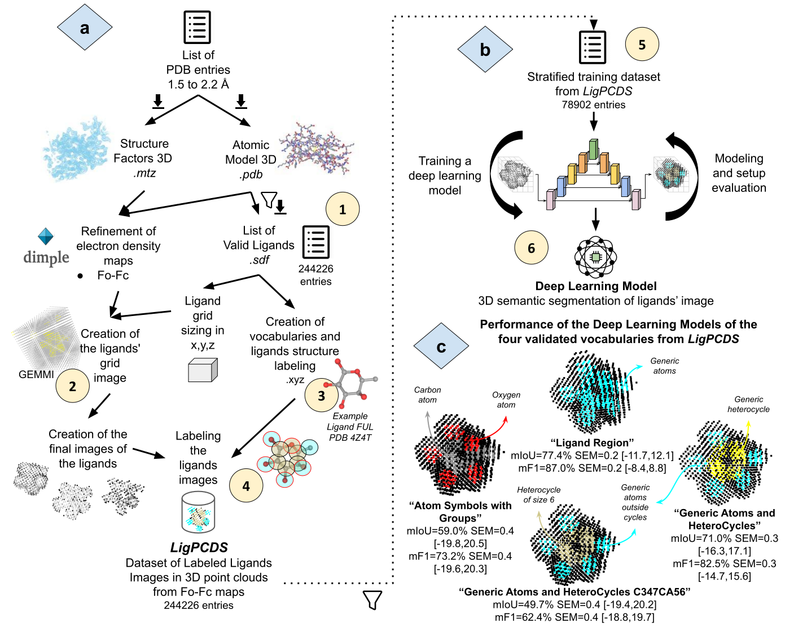
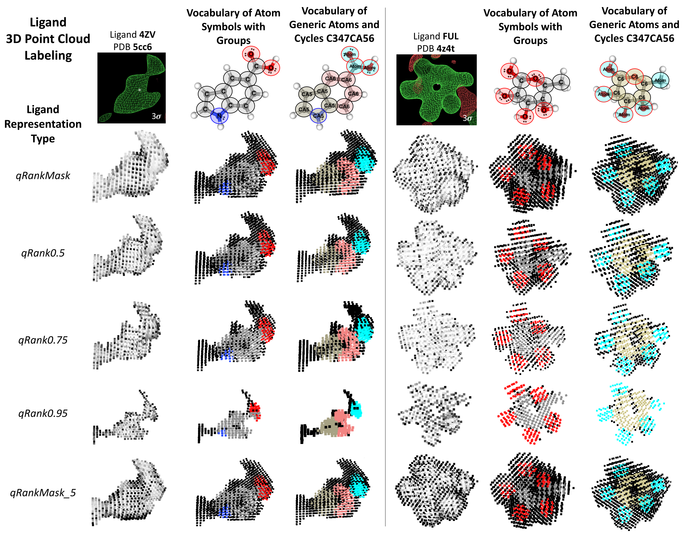

# NP³ LigPCDS: Labeled Dataset of X-ray Protein Ligand Images in 3D Point Cloud and Validated Deep Learning Models

This repository contains the code used to create the **LigPCDS v1.0.1** dataset and the stratified training dataset (steps 1 to 5 from parts A and B of the workflow). 
The code for the models training pipeline and validation (step 6 from part B and part C of the workflow) is presented in the np3_DL_segmentation repository.

The workflow used to obtain LigPCDS, the deep learning models, and the validated labeling approaches is presented in the figure below.



###### _Modified images 'Machine Learning' by Srinivas Agra and 'intelligence' by Gacem Tachfin from Noun Project (CCBY3.0)._

##### Part A: LigPCDS creation schema 

In Step 1, a list of PDB entries from 1.5 to 2.2 Å was retrieved (.pdb and .mtz) from RCSB PDB (https://www.rcsb.org/) in the end of 2019 and their free and organic ligands were filtered and validated (.sdf). It resulted in the list of valid ligands with 244,226 entries. 

In Step 2, Dimple (https://ccp4.github.io/dimple/) v2.6.1 was used to refine the PDB entries and produced their Fo-Fc maps. Next, for each ligand, it was defined a grid sizing that covers its entire blob. Each ligand grid was interpolated from its Fo-Fc map to a 3D point cloud and processed to create the final 3D representations of the ligands. 

In Step 3, vocabularies of chemical classes were created and used for labeling atom-wise the structure of the valid ligands. They were based on the chemical atoms themselves and on cyclic substructures of the ligands. 

Then, in Step 4 the labels of the structure of the ligands were extrapolated pointwise using an atomic sphere model for labeling the final representations of the ligands. This resulted in LigPCDS with 244,226 entries. 

The viable vocabularies and their labeling approaches are detailed bellow. It presents the vocabularies imbalance ratio (dmax) in the list of valid ligands, their classes names and size.

| Vocabulary                        | Labeling Approach | dmax   | Classes                                 | Number of Classes |
|-----------------------------------|:------------:|:--------:|------------------------------------------------|:-------------------:|
| Ligand Region                     | SP         | 1      | Background, Atom                               | 2                 |
| Generic Atoms and Cycles          | SP         | 2.1    | Background, Atom, C (Cycle)                            | 3                 |
| Generic Atoms and Cycles C347CA56 | SP         | 1535.2 | Background, Atom, C5 (Cycle of size 5), CA5, C6, CA6, C3, C4, C7 | 9       |
| Atom Symbols with Groups          | AtomSymbol | 41.4   | Background, C (carbon), O (oxigen), N (nitrogen), PSe, Halo      | 6       |


To exemplify the LigPCDS 3D point cloud labeling, five different ligand representation types and two ligands are used for illustration: 4ZV (PDB entry 5cc6, resolution 2.1 Å) and FUL (PDB entry 4z4t, resolution 1.8 Å). Their blob image from the Fo-Fc maps are shown in the top of the panel with a contour of 3σ (created with Coot). The LigPCDS visualization script was used to draw the ligands representations in 3D point cloud format.



##### Part B: The general schema used to train and obtain the validated DL models. 

In step 5 a stratified training dataset was created from LigPCDS with n=78,902 ligands entries, separated in k=13 similar groups.

In step 6 the LigPCDS entries of this dataset were used to train DL models in semantic segmentation tasks using Minkowski Engine (https://nvidia.github.io/MinkowskiEngine/) architecture and its modified networks based on the 3D U-Net; cycles of training, evaluation and changes continued until good performance DL models were obtained. 

##### Part C: Validated Vocabularies. 

Four of the proposed labeling approaches were validated, their models names follow the same order of the vocabulary used from the previous table.
The average performance in the cross-validation of their best DL model is presented below using the mIoU, mF1, Precision and Recall metrics. The 95% bootstrap confidence interval of the metrics is presented between squared brackets. 

| DL Model          | dmax | Loss  weights             | Epochs | Test mIoU | F1 score | Precision | Recall |
|-------------------|------|---------------------------|--------|-----------|----------|-----------|--------|
| LigandRegion      | 1    | 1,2.5                     | 120    | 77.4 [-11.7,12.1]     | 87.0 [-8.4,8.8]    | 86.5 [-8.7,9.1]     | 87.4 [-7.8,8.2]  |
| AtomCycles         | 1.4  | 1,2.5,2.5                 | 120    | 71.0 [-16.3,17.1]      | 82.5 [-14.7,15.6]    | 80.5 [-13.7,14.5]     | 84.9 [-11.7,12.6]  |
| Atom C347CA56     | 865  | 1,10,5,5,50,5,500,500,500 | 200    | 49.7 [-19.4,20.2]     | 62.4 [-18.8,19.7]    | 58.2 [-15.7,16.6]     | 74.1 [-14.9,15.8]  |
| AtomSymbol Groups | 81.5 | 16,16,44,108,853          | 160    | 59.0 [-19.8,20.5]     | 73.1 [-19.6,20.3]    | 68.6 [-18.8,19.5]     | 79.5  [-15.4,16.2] |

----------------------------

## Available data


- Two PDB report tables downloaded in September 2025 and pre-filtered to included free ligands (non-covalent) information and counts, located inside the PDB_lists folder:
  - _report_PDB_rcsb_pdb_2008-02-01_protein_xrayOnly_hasLigandFree_hasExpData.csv_ : list of PDB entries, their characteristics and total count of ligands 
  - _report_Ligands_rcsb_pdb_2008-02-01_protein_xrayOnly_hasLigandFree_hasExpData.csv_ : list of ligands IDs by PDB entry, their information, asymmetric ID (chain ID by author and validated) and free ligand tag
- List of valid ligands: located inside the 'PDB_lists/valid_ligands_list' folder in zip format:
  - _valid_ligands_list_PDB_1.5_2.2_NP_atoms_free_ligands_1_counts_2008-02-01_depDate_noQualityFilter_box_class_freq_qRankTested_0.5_AtomSymbol.zip_ : the valid ligands list labeled with the AtomSymbol-based approach
  - _valid_ligands_list_PDB_1.5_2.2_NP_atoms_free_ligands_1_counts_2008-02-01_depDate_noQualityFilter_box_class_freq_qRankTested_0.5_SP.zip_ : the valid ligands list labeled with the SP-base approach
  - _valid_ligands_list_columns_description.csv_ : a table describing the columns of the tables with the list of valid ligands
- The proposed vocabularies and mappings for the viable labeling approaches, located in the 'vocabularies' folder:
  - AtomSymbol-based : a folder with the AtomSymbol-based vocabulary (.txt) and mapping tables (.csv)
  - SP-based : a folder with the SP-based vocabulary (.txt) and mapping tables (.csv)
- A table with the atomic radii from theoretical and experimental data, located in the root folder:
  - _atomic_radii_tables.csv_

#### LigPCDS - dataset record

The LigPCDS v1.0.1 can be retrieved from Zenodo, an open dissemination research data repository. The deposit data is located in record [10.5281/zenodo.7872577](https://doi.org/10.5281/zenodo.7872577), and contains:

- LigPCDS-SP_record : The dataset with the SP-based modeling representations in 3D point cloud, vocabulary, structure labeling result (xyz record) and DL models.
- LigPCDS-AtomSymbol_record : The dataset with the AtomSymbol-based modeling representations in 3D point cloud, vocabulary, structure labeling result (xyz record) and DL models.
- LigPCDS-Grids_reso-1.5-2.2_gridspace-0.5 : The dataset with the ligand grid representation of the list of valid ligands.

---------------------------
---------------------------

## How to use

The following steps correspond to parts A and B from the workflow to create the LigPCDS dataset and the stratified training dataset. 
The scripts used in each step from 1 to 5 are detailed below in separated subsections. Here Step 3 is presented before 
Step 2 to easy the use of the available scripts, this does not affect the order of Figure 1 because Steps 2 and 3 are parallel procedures.

At the end, there is also some available visualization scripts and an additional testing script.

### Step 1

--------------------

#### 1.1 Download PDB Report Lists (Manual) 

To retrieve the PDB report lists, manually access the advanced search tool from [RCSB PDB](https://www.rcsb.org/search/advanced) 
and apply the following filters (used in September 2025 for LigPCDS):
- Experimental Method is X-ray Diffraction (this will also filter experiments with multiple methods): Experimental Method | is | X-RAY DIFFRACTION 
- Experiments with proteins only: Entry Polymer Types | is | Protein (only)
- Containing free ligands (non-covalent): Component Identifier - Has No Covalent Linkage | is not empty 
- Containing experimental data (with electron density maps also deposited): Has Experimental Data | is | Y
- Experiments deposited after february 2008:  Deposit Date | >= | 2008-02-01

Then generate two custom report list, one for structures (PDB entries) and another for ligands (ligand entries). 
And directly download the reports as CSV tables, the RCSB website return them by chunks of 2500 rows. 
All the chunks must be retrieved and further concatenated using the script presented in the next subsection 1.1.1 (continuation of this step).
Finally, in the final subsection 1.1.2 the report lists are pre-filtered to maintain only X-ray experiments 
(remove experiments with multiple methods), to retrieve the free ligands information and to count the number of ligands by entry.

The RCSB PDB report lists downloaded for LigPCDS were retrieved in September 2025, pre-filtered and are present in the PDB_lists folder, 
their names and information are described below:
- PDB report list: _report_PDB_rcsb_pdb_2008-02-01_protein_xrayOnly_hasLigandFree_hasExpData.csv_
  - List of PDB entries, their characteristics and number of ligands. It must contain the PDB ID, deposition date, total number of non-polymers (ligands), all Cell Dimensions and Space Group and all Methods and X-ray Method Details.
- Ligand report list: _report_Ligands_rcsb_pdb_2008-02-01_protein_xrayOnly_hasLigandFree_hasExpData.csv_ 
  - List of ligands ID by PDB ID, their features and chains where they appear (asymmetric ID by author or validated). It must contain the Entry ID (PDB ID), the ligand entries chains (asym ID and auth asym ID) and feature information (e.g. ligand ID, molecular formula, SMILES).


###### 1.1.1 Concatenate the Chunks of PDB Report List 

Concatenate the chunks of the report tables downloaded from RCSB PDB into a single file. The user must store all the 
chunks in a single folder and observe the pattern of the file names. 
The following script will automatically concatenate the all the files inside the given folder that matches the naming pattern and 
will store the result inside this directory.

*Run:*

> ``` python src/concatenate_rcsb_report_tables_csv.py dir_path output_report_name files_pattern n_skip_rows```

*Parameters:*

     1. dir_path: The path to the diretory containing the report tables in chunks and where the output concatenated report table will be stored;
     2. output_report_name: (default to 'rcsb_pdb_custom_report_all.csv') concatenated PDB report output name;
     3. files_pattern: (default to 'rcsb_pdb_custom_report_*.csv') PDB report file pattern;
     4. n_skip_rows: (default to 1) number of initial rows to skip from the reports.

*Return:*

The concatenated report table is created inside dir_path and named with the output_report_name, 
by default it is called 'dir_path/rcsb_pdb_custom_report_all.csv'. 

*Example:*

> ``` python src/concatenate_rcsb_report_tables_csv.py /path/to/dir/containing/chunks/of/PDB/structure/report/table/ rcsb_pdb_custom_structure_report_all.csv```

> ``` python src/concatenate_rcsb_report_tables_csv.py /path/to/dir/containing/chunks/of/PDB/ligands/report/table/ rcsb_pdb_custom_ligand_report_all.csv```


###### 1.1.2 Pre-filter the PDB report tables, format the column names and retrieve free ligand information 

This final process of step 1 will pre-filter the concatenated PDB report tables to only keep data from pure X-ray diffraction experiments
(remove PDB entries collected with another method coupled to X-ray), to rename the column names removing spaces and removing
special characters between parenthesis, to forward fill the EntryID column in the ligands report table (fill missing values), and finally, 
to retrieve from the RCSB API the free ligand information (long process) to enrich the reports.

This step depends on the RCSB API (the end point used is from September 2025) and may face server out of service errors.
In case the process stop due to a server error when accessing this API, a partial result is always saved in the output_path after 1000 
iterations together with the last processed iteration and the process may be resumed using the extra parameter 'skip' 
and informing the partial results in the report tables - the job will continue from this iteration. The partial results 
are removed in case the job finishes.

The free ligand information process will search, for each ligand ID present in the report_Ligands_path, the respective 
PDB entries (PDB IDs) in which it appears as a free ligand (non-covalent). This information will be stored in a flag column 
to signalize with True or False the PDB IDs where the ligand ID is a free ligand or not.

*Run:*

> ``` python src/prefilter_rcsb_report_tables_renameCols_xrayOnly_freeLigands_valid_PDB.py report_PDB_path report_Ligands_path output_path skip```

*Parameters:*

        1. report_PDB_path: The path to the PDB structure report table downloaded from RCSB PDB and concatenated in previous step (CSV format). It must contain structure data. In case of resuming from a previous run, this should be the result table with xRayOnly;
        2. report_Ligands_path: The path to the Ligands report table downloaded from RCSB PDB and concatenated in previous step (CSV format). It must contain ligand (non-polymer entity) data. In case of resuming from a previous run, this should be the partial result table;
        3. output_path: The path to the output directory where the resulting pre-filtered and enriched tables will be stored;
        4. skip: (Default to 0 - start from the beggining) The iteration where a partial result ended, in case the process had an error in the server communication and need to restore from a partial result - this must be the last iteration saved in a txt file together with the partial result (after first 1000 iterations).

*Return:*

Four tables will be created in the output_path as a result of filtering and enriching the PDB and the Ligands reports from RCSB PDB:
  - report_PDB_rcsb_pdb_2008-02-01_protein_xrayOnly_hasLigand_hasExpData.csv : The PDB structure report table with only X-Ray experimental method entries filtered and columns formatted 
  - report_Ligands_rcsb_pdb_2008-02-01_protein_xrayOnly_hasLigand_hasExpData.csv : The Ligands report table with only X-Ray experimental method entries filtered and columns formatted
  - report_Ligands_rcsb_pdb_2008-02-01_protein_xrayOnly_hasLigandFree_hasExpData.csv : The Ligands report table pre-filtered with only X-Ray exp and Free ligands information retrieved and signalized in a new column 'freeLigand' with True or False values 
  - report_PDB_rcsb_pdb_2008-02-01_protein_xrayOnly_hasLigandFree_hasExpData.csv: The PDB structure report table pre-filtered with only X-Ray exp and Free ligands counts in new columns 'NumberofDistinctFreeLigands' and 'TotalNumberofFreeLigands'

*Example:*

> ``` python src/prefilter_rcsb_report_tables_renameCols_xrayOnly_freeLigands_valid_PDB.py rcsb_pdb_custom_structure_report_all.csv rcsb_pdb_custom_ligand_report_all.csv /path/to/output/dir/to/store/preprocessed_reports/ 0```


#### 1.2 Filter PDB List  

Filter the RCSB PDB pre-filtered report lists using as criteria the PDB entries resolution, a list of organic atoms 
(natural products filter), the minimum deposit date of the PDB entries and the ligand's counts by PDB entry.
These report list must be the result of step 1.1.2, and follow the table format exported by RCSB PDB in September 2025 and pre-filtered. 

*Run:*

> ``` Rscript src/filter_pdb_lig_report_list.R pdb_report ligand_report min_pdbids resolution_min resolution_max np_filter deposit_date_min all_ligands```

*Parameters:*

       1. pdb_report: Path to the pre-filtered PDB structure report list (with free ligand information) - CSV table containing the PDB entries information, mandatory columns (spaces are removed): PDBID, RefinementResolution, DepositionDate;
       2. ligand_report: Path to the pre-filtered Ligand report list - CSV table containing the ligands entries by ligand ID and PDB entries in which they appear, with the following mandatory columns (spaces are removed): EntryID, LigandID, LigandFormula, AsymID, AuthAsymID, freeLigand;
       3. min_pdbids: Minimum number of PDB entries (IDs) in which a ligand must be present to be included in the resulting list of entries;
       4. resolution_min: Minimum resolution of a PDB entry to be included in the resulting list;
       5. resolution_max: Maximum resolution of a PDB entry to be included in the resulting list;
       6. np_filter: TRUE or FALSE to apply the natural products filter and only retain ligands that have the following organic atoms: C,H,O,N,P,S,I,Br,Cl,F,Se;
       7. deposit_date_min: The minimum deposit date that a PDB entry must have to be included in the resulting list (default to no deposit date filter). All filtered entries must have been deposited after or in this date. The informed date must follow the format yyyy-mm-dd, as in 2008-02-01 (used in LigPCDS), where yyyy is the year, mm is the month and dd is the day.
       8. all_ligands: (Default to FALSE - filter the free ligand) TRUE or FALSE to indicate to keep all ligands or to filter only the Free ligands (non-covalent).

*Return:*

Two CSV files with the filtered lists and with the ligands aggregated by PDBID. The files will be saved to the current directory and will be named as follows:

    - PDB_<min_resolution>_<max_resolution>_<NP|all>_atoms_<all|free>_ligands_<min_count>_counts<_<deposit_data_fitler>_depDate|>.csv
    - ligands_<all|free>_PDB_<min_resolution>_<max_resolution>_<NP|all>_atoms_<min_count>_counts<_<deposit_data_fitler>_depDate|>.csv

*Example (used to create LigPCDS v1.0.1):*

> ``` Rscript src/filter_pdb_lig_report_list.R PDB_lists/pre-filtered_reports/report_PDB_rcsb_pdb_2008-02-01_protein_xrayOnly_hasLigandFree_hasExpData.csv PDB_lists/pre-filtered_reports/report_Ligands_rcsb_pdb_2008-02-01_protein_xrayOnly_hasLigandFree_hasExpData.csv 1 1.5 2.2 TRUE 2008-02-01 FALSE```


#### **1.3 Download PDB Entries Data + Ligands Data** 

Retrieve the data present in the provided filtered report lists 
from the PDB IDs (structure factors and protein structure) in .cif and convert them using gemmi to .pdb and .mtz files (subsection 1.3.1); 
and also, retrieve the data of the ligands (.sdf) and extract their .pdb from the respective Entry ID (subsection 1.3.2).
The downloaded .pdb and .sdf are parsed to check their viability, 
any error when reading this files will result in their deletion (together with their related files) due to invalid data.

The data from subsection 1.3.1 will enable the refinement of the entries with and without the ligands structure, and the data from
subsection 1.3.2 will be used to further extract the molecular structure of the ligands for labeling the dataset. 

These subsections are parallel process that may be executed together to accelerate the downloads. This step is a long 
process and may face server errors, and will need to be restarted and rerun to guarantee that all existing and 
valid data was successfully downloaded.  

The code was intended to work with RCSB PDB APIs from september 2025. Any updates in RCSB PDB API must be updated in the code.
  
###### 1.3.1 Download PDB structure report data 

For each PDB ID present the given structure report list, retrieve the pdb .cif and sf.cif data and convert them 
to .pdb and .mtz data. Parse the .pdb data to check it's viability, if any error occurs the related data is removed. 

*Run:*

> ``` python src/fetch_pdb_mtz_cif_entries.py db_path pdb_report_entries row_entry_start row_entry_stop ```

*Parameters:*

    1. db_path: The path to the data folder where the data will be stored. Four folders will be created inside it (see Return).
    2. pdb_report_entries: The path to the CSV file containing the PDB ids to be retrieved. This is expected to be the output of the step 1.2. Mandatory column = 'PDBID';
    3. row_entry_start: (default to 0) The number of the row where the script should start. Skip to the given row or start from the beginning;
    4. row_entry_stop: (default to 0 - last row of the provided table) The number of the row of the ligands CSV file where the script should stop. Stop in the given row or, if missing, stop in the last row.
  
*Return:*

The db_path folder is created and inside it four subfolders are created: 

    - 'sf_cif': to store the structure factors in .cif (default format now)
    - 'pdb_cif': to store the PDB structures in .cif (default format now)
    - 'pdb': to store the converted .pdb files
    - 'coefficients': to store the converted .mtz files;

*Example:*

> ``` python src/fetch_pdb_mtz_cif_entries.py data/ PDB_lists/PDB_1.5_2.2_NP_atoms_free_ligands_1_counts_2008-02-01_depDate.csv```


###### 1.3.2 Download Ligand report data 

For each Ligand ID present the given ligand report list, retrieve the ligands .sdf data, parse it and, if valid, 
extract the ligands .cif from the PDB ID structure data in .cif.

*Run:*

> ``` python src/fetch_sdf_ligands_pdb_cif_res.py db_path ligand_report_entries row_entry_start row_entry_stop ```

*Parameters:*

    1. db_path: The path to the data folder where the data will be stored. One folder will be created inside it.
    2. ligand_report_entries: The path to the CSV file containing the ligands report list to be retrieved and the PDB ids in which they appear. Mandatory columns = 'EntryID', 'LigandID', and 'AuthAsymID'. The last column must contain the chains where the respective LigandID is located in the respective EntryID of the author submission;
    3. row_entry_start: (default to 0) The number of the row of the ligands CSV file where the script should start. Skip to the given row or, if missing, start from the beginning;
    4. row_entry_stop: (default to 0 - last row) The number of the row of the ligands CSV file where the script should stop. Stop in the given row or, if missing, stop in the last row.
  
*Return:*

The db_path folder is created, if not present yet, and inside it one subfolder is created: 

    - 'ligands': to store the .sdf and the .cif files of the ligands;

*Example:*

> ``` python src/fetch_sdf_ligands_pdb_cif_res.py data/ PDB_lists/ligands_free_PDB_1.5_2.2_NP_atoms_1_counts_2008-02-01_depDate.csv```


#### 1.4 List of Available Ligands

The list of available ligands contains the entries that were retrieved (download ok) and have a valid SDF file.

This step will check if the SDF files of the retrieved ligands (ligands_data_folder) are valid and will add the information of the valid entries to the list of available ligands.
If the SDF file of a ligand entry can be parsed by rdkit (https://www.rdkit.org/) and results in a valid molecular graph, then this ligand's file is valid. Otherwise it is removed from the resulting list.

*Run:*

> ``` python src/list_valid_sdf_ligands_and_info.py ligands_data_folder```

*Parameters:*

    1. ligands_data_folder: The path to the data folder where the SDF files of the retrieved ligands are located.
   
*Return:*
        
One table will be created in the current directory named: 
    
    - db_ligand_path.name+'_valid_sdf_info.csv' : containing the list of available ligands with a valid SDF file and their information.

*Example:*

> ``` python src/list_valid_sdf_ligands_and_info.py data/ligands```


#### 1.5 Quality filters in the PDB and in the Available Ligands lists 

Filter the free ligands, compute some parameters and apply global quality filters (parameters) to all filtered PDB entries and available ligand entries present in the provided lists.

*Run:*

``` 
python src/quality_filter_pdb_ligands_lists.py pdb_list_file ligands_list_file db_path valid_ligands_list_file bfactor_ratio_max bfactor_std_max min_occupancy_cutoff allow_missingHeavyAtoms max_num_disordered 
```

*Parameters:*

    1. pdb_list_file: The path to the CSV file containing the list of filtered PDB entries (result of step 1.2). Mandatory columns = 'PDBID', 'RefinementResolution', 'SpaceGroup', 'AverageBFactor';
    2. ligands_list_file: The path to the CSV file containing the list of filtered ligands entries present in the filtered PDB entries (result of step 1.2). Mandatory columns = 'EntryID', 'LigandID', 'freeLigand',  'LigandFormula', 'LigandMW', 'numTotalCount';
    3. db_path: The path to the data folder where the directories 'pdb' and 'coefficients' are located;
    4. valid_ligands_list_file: The path to the CSV file containing the list of available ligands with a valid sdf file and their info (result of step 1.4). Mandatory columns: ligID, entry, ligCode, bfactor, min_occupancy, missingHeavyAtoms, numDisordered;
    5. bfactor_ratio_max: The maximum allowed bfactor ratio between a ligand bfactor and its PDB entry bfactor;
    6. bfactor_std_max: The maximum allowed bfactor standard deviation between the ligand atom's bfactor;
    7. min_occupancy_cutoff: The minimum occupancy cutoff to keep a ligand;
    8. allow_missingHeavyAtoms: The missingHeavyAtoms boolean TRUE (1) or FALSE (0) to allow missing heavy atoms in the ligands. If FALSE, no ligands entries with missing heavy atoms will be allowed;
    9. max_num_disordered: The maximum numDisordered that a ligand entry is allowed to have. 

*Return:*

Two tables will be created in the current directory:
   
    - '<pdb_list_file.name>_filter_bfRatio_<bfactor_ratio_max>_bfStd_<bfactor_std_max>_occ_<min_occupancy_cutoff>_missHAtoms_<allow_missingHeavyAtoms>_numDisorder_<max_num_disordered>.csv' : containing the filtered pdb entries that passed the quality criteria;
    - '<valid_ligands_list_file.name>_<pdb_list_file.name>_filter_bfRatio_<bfactor_ratio_max>_bfStd_<bfactor_std_max>_occ_<min_occupancy_cutoff>_missHAtoms_<allow_missingHeavyAtoms>_numDisorder_<max_num_disordered>.csv' : containing the ligands that passed the quality criteria. This is the list of available ligands with quality filters and additional parameters.

*Example:*

Do not apply the quality filters related to bfactor, occupancy and disorder (as used in LigPCDS v1.0.1 creation).
> ``` python src/quality_filter_pdb_ligands_lists.py PDB_1.5_2.2_NP_atoms_free_ligands_1_counts_2008-02-01_depDate.csv ligands_free_PDB_1.5_2.2_NP_atoms_1_counts_2008-02-01_depDate.csv data/ ligands_valid_sdf_info.csv 10000 10000 0 TRUE 10000```

### Step 3

--------------------

#### 3.1 Vocabulary Creation and Ligand Structure Labeling 

Create a vocabulary from the list of valid ligands that passed the quality filter and use it to label the structure of the ligands. 

The SMILES of each ligand will be used to extract all the classes necessary to label the provided list of valid ligands filtered. 
The unique list of classes will compose the new vocabulary.
Then, it will get each ligand SDF file and use the new vocabulary to label the atoms of the ligands. 
Finally, for each ligand its structure labeling result will be exported to a .xyz file, 
containing the class of each atom by row and their 3D coordinates and label by column. 
Also computes the sizing of the ligand grid, a minimum bounding box around the ligand atomic positions 
(minimum and maximum position in xyz) plus a gap in all axis equal to 4.2 Angstrons and 
centered in its atomic positions center value. 

The vocabulary can be based on: the atom's SP hybridization concatenated with cyclic information (SP-based) or 
the atom's symbols concatenated with cyclic information (AtomSymbol-based). 
The user must choose one of these major labeling approaches using the parameter 'label_SP'.

During the labeling of the ligand's SDF file, a reverse engineering testing is applied. 
It matches the labels of the ligand's atoms from their SDF files against their predicted labels using the ligand's SMILES. 
If a ligand have missing atoms in its SDF file, then try to match only the present substructure. 
Ligands with mismatching labels in this test are removed. 
Ligands with bad defined SDF files, that raises an error when reading them are also removed here.

*Run:*

> ``` python src/run_vocabulary_encode_ligands.py data_folder_path valid_ligands_filtered_list_path label_SP row_start row_end ```

*Parameters:*

1. data_folder_path: The path to the data folder where the vocabulary output will be stored and where the 'ligands' folder with the ligands in .sdf format is located.
2. valid_ligands_filtered_list_path: The path to the CSV file containing the valid ligands list and their smiles with the quality filters applied. This file is expected to be the output of the quality filter script (step 1.5 result).
   Mandatory columns = 'ligID','smiles','ligCode','missingHeavyAtoms'. The name of this file will be used to label the output vocabulary file, the ligand's SMILES dataset file and the xyz folder, which will store the labeled ligands .xyz files;
3. label_SP: (optional) Set to 'True' to use the SP-based approach to create the vocabulary (default), otherwise it will use the AtomSymbol-based labeling approach. Both labeling approaches contains the atoms' cyclic information.
4. row_start: (optional) The number of the row in the valid_ligands_filtered_list_path file where the script should start. Skip to the given row or, if missing, start from the beginning;
5. row_end: (optional) The number of the row in the valid_ligands_filtered_list_path file where the script should stop. Stop in the given row or, if missing, stop in the last row.

*Return:*

Two files will be created inside the data_folder_path directory:
   - 'ligs_smiles_<valid_ligands_filtered_list_path.name>.txt' containing all the SMILES used in the vocabulary creation (the SMILES dataset file) and;
   - 'vocabulary_<valid_ligands_filtered_list_path.name>.txt' containing all the classes that resulted from the SMILES labeling, with one class by row (the vocabulary itself). The rows order indicate the index of the vocabulary classes, starting in 0.

And one folder called 'xyz_<valid_ligands_filtered_list_path>_<SP|AtomSymbol>' will be created inside the 
<data_folder_path> folder to store the labeled structure of the ligands (its suffix depends on the label_SP value), 
it will contain:
   - One .xyz file for each successfully labeled ligand structure present in the valid_ligands_filtered_list_path file, containing the ligands' atoms by row with their information and label;
   - One CSV file named '<valid_ligands_filtered_list_path>_box_class_freq.csv' containing the list of valid ligands that had their structure successfully labeled, plus their bounding box sizing and vocabulary classes frequency (number of labeled atoms by class);
        - The column 'filter_quality' equals to TRUE indicate the successfully labeled entries; and when it is equal to FALSE, indicate ligands entries that raised an error in this step. This column may be used to filter the list of successfully labeled entries.

*Example:*

SP-based structure labeling.
> ``` python src/run_vocabulary_encode_ligands.py data/ ligands_valid_sdf_info_filter_bfactor_10000_occ_10000_missHAtoms_TRUE_numDisorder_10000.csv True```

AtomSymbol-based structure labeling.
> ``` python src/run_vocabulary_encode_ligands.py data/ ligands_valid_sdf_info_filter_bfactor_10000_occ_10000_missHAtoms_TRUE_numDisorder_10000.csv False```

###### 3.1.1 Ligand Structure Labeling with other vocabulary

To label the structure of the ligands using another vocabulary previous created, in order to maintain its classes order, 
the script to encode the ligands structure may be directly called. 

The provided vocabulary must cover all the classes that will 
appear in the provided list of valid ligands, otherwise an error will be trigged. This should only be done to keep a 
pre-defined order of the vocabulary classes. 

During the labeling of the ligand's SDF file, a reverse engineering testing is applied. It matches the labels of the ligand's atoms from their SDF files against their predicted labels using the ligand's SMILES. If a ligand have missing atoms in its SDF file, then try to match only the present substructure. 
Ligands with mismatching labels in this test are removed. Ligands with bad defined SDF files, that raises an error when reading them are also removed here.

*Run:*

> ``` python src/encode_ligs_xyz.py ligands_data_folder valid_ligands_filtered_list_path vocab_path label_SP row_start row_end ```

*Parameters:*

1. ligands_data_folder: The path to the ligand data folder called 'ligands' where the ligands sdf files are located. Its parent folder is expected to the data_folder_path.
2. valid_ligands_filtered_list_path: The path to the CSV file containing the list of valid ligands and their SMILES. 
This file is expected to be the output of the quality filter script (step 1.5). Mandatory columns = 'ligID','ligCode','missingHeavyAtoms','smiles'.
The name of this file will be used to label the output xyz folder, which will store the labeled ligands .xyz files;
3. vocab_path: The path to the text file containing the desired vocabulary to be used to label the ligands structure. 
It must contain one class per line. The ligands SDF will be fragmented and its atoms classes will be matched against this
list to be labeled using the vocabulary index order
4. label_SP: (optional) Set to 'True' to use the SP-based approach to create the vocabulary (default), otherwise it will use the AtomSymbol-based labeling approach. Both labeling approaches contains the atoms' cyclic information.
5. row_start: (optional) The number of the row in the valid_ligands_filtered_list_path file where the script should start. Skip to the given row or, if missing, start from the beginning;
6. row_end: (optional) The number of the row in the valid_ligands_filtered_list_path file where the script should stop. Stop in the given row or, if missing, stop in the last row.

*Return:*

One folder will be created inside the parent folder of the ligands_data_folder, named: 
- 'xyz\_\<ligand csv name\>\_<SP|AtomSymbol>': to store the labeled structure of the ligands in xyz coordinate file. 
Its suffix is determined by the label_SP value. It will contain:
  - One .xyz file for each successfully labeled ligand structure present in the valid_ligands_filtered_list_path file, containing the ligands' atoms by row with their information and label;
  - One CSV file named '<valid_ligands_filtered_list_path>_box_class_freq.csv' containing the list of valid ligands that had their structure successfully labeled, plus their bounding box sizing and vocabulary classes frequency (number of labeled atoms by class);
    - The column 'filter_quality' equals to TRUE indicate the successfully labeled entries; and when it is equal to FALSE, indicate ligands entries that raised an error in this step. This column may be used to filter the list of successfully labeled entries.

*Example:*

SP-based structure labeling.
> ``` python src/encode_ligs_xyz.py data/ ligands_valid_sdf_info_filter_bfactor_10000_occ_10000_missHAtoms_TRUE_numDisorder_10000.csv vocabulary_valid_ligands_PDB_1.5_2.2_SP-based_newClasses.txt True```

AtomSymbol-based structure labeling.
> ``` python src/encode_ligs_xyz.py data/ ligands_valid_sdf_info_filter_bfactor_10000_occ_10000_missHAtoms_TRUE_numDisorder_10000.csv vocabulary_valid_ligands_PDB_1.5_2.2_SP-based_newClasses.txt False```


### Steps 2 and 4

----------------------

Ligand representation in 3D point cloud creation and labeling.

#### 2.1 Refinement

Execute Dimple to refine the retrieved entries present in a PDB list. A 2x slow refinement is performed and without hetero atoms (hetatm removed). 
This allows the blob of the ligands to appear in their calculated Fo-Fc map.

This is a slow step. At least 10 minutes is expected for the refinement of each entry in a personal computer.

*Run:*

> ``` python src/refinement_dimple.py data_folder_path pdb_list_path num_parallel overwrite```

*Parameters:*

1. data_folder_path: The path to the data folder where the 'pdb' and the 'coefficients' folders are located, containing the files of the PDB entries named as 'pdb<PDBID>.ent' and '<PDBID>.mtz', respectively. A folder named 'refinement' will be created inside the data_folder_path to store the Dimple results in separated subfolders by PDB entry.
2. pdb_list_path: The path to a CSV table with the PDB list to be refined. Mandatory column: 'PDBID' with the PDB entries IDs (they will be converted to lower case).
3. num_parallel: (optional) The number of processors to use for multiprocessing parallelization (default to 2);
4. overwrite: (optional) A boolean True or False indicating if the already refined entries should be overwritten (True) or skipped (False). Default to False.

*Output:*

A folder named 'refinement' will be created inside the data_folder_path to store the Dimple results in separated subfolders by PDB entry.

If overwrite is False, it will skip the already refined entries and continue from the last not refined entry.

*Example:*

> ``` python src/refinement_dimple.py data/ PDB_1.5_2.2_NP_atoms_free_ligands_1_counts_2008-02-01_depDate_filter_bfactor_10000_occ_10000_missHAtoms_TRUE_numDisorder_10000.csv 10```


#### 2.2 Ligand Grid Representation Creation 

Creates the ligand grid representation in 3D point cloud for all ligand entries that had their structure successfully labeled and refined.

For each ligand entry, it reads the respective PDB entry Fo-Fc map from the refined MTZ file (parameter refinement_path); 
and the ligand atomic positions from the ligand's structure label file .xyz (parameter xyz_labels_path). 
Then, it extracts the ligand grid representation from the refined Fo-Fc map of its PDB entry, 
located inside a bounding box around its atomic positions plus a gap and using a grid spacing equal to 0.5 by default (parameter grid_space). 
And finally, the representation will be stored in a 3D point cloud file inside the subfolder of each PDB entry in the output path (parameter output_grid_path).

*Run:*

> ``` python src/mtz_to_grid_pointcloud.py xyz_labels_path refinement_path output_grid_path overwrite num_parallel grid_space```

*Parameters:*

1. xyz_labels_path: The path to the data folder called 'xyz_\<valid ligand list file name\>\_<SP|AtomSymbol>' where the 
ligands .xyz files with their atomic positions and structure labels are located. It must also contain the CSV file with 
the list of valid ligands and their grid sizing and position. This file must be named as
'\<valid ligand list file name\>_<SP|AtomSymbol>_box_class_freq.csv' and is expected to be the output of the 
'run_vocabulary_encode_ligands.py' or the 'encode_ligs_xyz.py' scripts. 
Mandatory columns = 'ligID', 'ligCode', 'entry', 'filter_quality', 'x', 'y', 'z', 'x_bound', 'y_bound','z_bound', 'RefinementResolution'.;
2. refinement_path: The path to the data folder where the entries refinement are located ('data/refinement').
3. output_grid_path: The path to the output folder where the 3D point clouds of the ligands grid will be stored in .xyzrgb files. It will be organized by the PDB entry ID of the ligand entries in separated subfolders, each one containing the grid representations of all ligands that appear in that PDB entry ('data/ligands_grid_point_clouds');
4. overwrite: (optional) A boolean True or False indicating if the already processed ligands should be overwritten. Useful to restart from previous processing. (Default to False).
5. num_parallel: (optional) The number of processors to use for multiprocessing parallelization (Default to 2).
6. grid_space: (optional) A numeric defining the grid spacing size in angstroms to be used in the 3D point clouds creation for the ligand grid representation (Default to 0.5 A).

*Output*

The output_grid_path folder will be created with one subfolder for each PDB entry of the ligand entries that had their grid representation successfully created:
- The subfolder of each PDB entry will contain the grid 3D point cloud of each ligand (.xyzrgb files) that appear in the respective PDB entry and that had their grid representation successfully created.

One file will be created inside the xyz_labels_path directory:
- One CSV file named '\<valid ligand list file name\>_<SP|AtomSymbol>_box_pc.csv' containing the list of valid ligands that had their grid representation successfully created. 
It will also add columns with the electron density descriptive statistics of the grid of each ligand (mean value, standard deviation and others).

*Example:*

> ``` python src/mtz_to_grid_pointcloud.py data/ligands/xyz_ligands_valid_sdf_info_filter_bfactor_10000_occ_10000_missHAtoms_TRUE_numDisorder_10000_SP data/refinement/ data/ligs_point_cloud_grid True 4 0.5```

#### 2.3 Ligands Final Representation Creation and Labeling (Step 4)** 

Create the final representations of the ligands in 3D point cloud and scaled and also create their labeling files for each representation type.

For each ligand entry that had its ligand grid representation successfully created, it will scale it using the quantile rank scale, extract the ligand mask representation and then create the final representations of the ligands. The following representation types will be created: 
qRank0.5, qRank0.7, qRank0.75, qRank0.8, qRank0.85, qRank0.9, qRank0.95, qRankMask, and qRankMask_5.
At the end, the final representations will be stored in a 3D point cloud file inside the subfolder of each PDB entry of the ligand entries
in the output path (parameter output_LigPCDS_path).

*Run:*

> ``` python src/grid_pointcloud_to_quantile_rank_scale.py xyz_labels_path output_grid_path output_ligPCDS_path num_parallel overwrite row_start row_end```

*Parameters:*

1. xyz_labels_path: The path to the data folder called 'xyz_<valid ligand list csv name>' where the ligands .xyz files 
with their structure labels are located. It must also contain the CSV file with the list of valid ligands that had the 
ligand grid representation successfully created. This file is named as '<valid ligand list csv name>_box_pc.csv' and is 
expected to be the output of the mtz_to_grid_pointcloud.py script. Mandatory columns = 'ligID', 'ligCode', 'entry', 'RefinementResolution';
2. output_grid_path: The path to the folder where the ligand grid representations in point clouds are stored ('data/lig_point_clouds_grids');
3. output_ligPCDS_path: The path to the output folder where the point clouds of the final representations of the ligands in quantile rank scale will be stored ('data/lig_pcds' or other);
4. num_parallel: (optional) The number of processors to use for multiprocessing parallelization (Default to 2);
5. overwrite: (optional) A boolean True or False indicating if the already processed ligands should be overwritten (Default to False);
6. row_start: (optional) The number of the row of the '<valid ligand list csv name>_box_pc.csv' file where the script should start. Skip to the given row or, if missing, start from the beginning;
7. row_end: (optional) The number of the row of the '<valid ligand list csv name>_box_pc.csv' file where the script should stop. Stop in the given row or, if missing, equal to zero or greater than the number of rows, stop in the last row.

*Output:*

The output_ligPCDS_path folder will be created with one subfolder for each PDB entry of the ligand entries that had all their final representations successfully created and labeled:
- The subfolder of each PDB entry will contain the final representations of all ligands (.xyzrgb files) that appear in the respective entry and that had all of their representations types successfully created.

One file will be created inside the xyz_labels_path directory:
- One CSV file named '\<valid ligand list csv name\>_box_class_freq_qRank_scale.csv' containing the list of valid ligands that had their final representations successufully created. 
It will also add columns with the size of the final 3D point clouds of the ligands by representation type. 
The size of these representations is equal to the number of points in their point clouds for each type.

*Example:*

> ``` python src/grid_pointcloud_to_quantile_rank_scale.py data/ligands/xyz_ligands_valid_sdf_info_filter_bfactor_10000_occ_10000_missHAtoms_TRUE_numDisorder_10000_SP data/ligs_point_cloud_grid data/ligs_pcds_SP 4```

#### 2.4 Ligand Representation Labeling Test 

Tests the labels of the ligands representations against their expected labels from their structure labeling (in .xyz files from their SDF files). 
It will check for each atom of a ligand if the points around it in its representation and inside 1/4 of its atomic sphere have all the same label and equals to the expected label from its structure labeling result (.xyz file).
For each representation type, it also computes two metrics: the percentage of points in the background class; 
and the average percentage of covered points by the atomic sphere of the ligand's atoms (number of points present inside each atom's atomic sphere / expected number of points that fits in each atom's atomic sphere).
A low percentage of atom coverage may indicate low quality representations (from low quality blobs). The opposite may also be true or noise.
  
If draw_pc is enabled, it will draw the ligands point clouds being tested and will color the final representations using the valid labels.

*Run:*

> ``` python test/test_ligands_pointcloud_label_qRankScale.py xyz_folder_path output_ligPCDS_path num_parallel draw_pc```

*Parameters:*

 1. xyz_labels_path: The path to the data folder called 'ligands/xyz_<valid ligand list csv name>' where the ligands .xyz files with their atomic positions and structure labels are located. It must also contain the CSV file with the list of valid ligands and their grid sizing and position. This file is named as '<valid ligand list csv name>_box_class_freq.csv' and is expected to be the output of the 'run_vocabulary_encode_ligands.py' script. Mandatory columns = 'ligID', 'ligCode', 'entry', 'filter_quality', 'x', 'y', 'z', 'x_bound', 'y_bound','z_bound';
 2. output_ligPCDS_path: The path to the data folder where the point clouds of the final representations of the ligands in quantile rank scale are be stored ('data/lig_pcds' or other);
 3. num_parallel: (optional) The number of processors to use for multiprocessing parallelization (default to 2);
 4. draw_pc: (optional) Boolean True or False to draw the ligands 3D point clouds. If True, enable drawing the final representations of the ligands and color them using their labels. If False, do not draw them (default to False).

*Output:*

One file is created inside the xyz_labels_path folder:
- One CSV file named '<valid ligand list csv name>_box_class_freq_qRankTested.csv' containing the **list of valid ligands** that had their final representations successfully created and tested.
This table also signalizes any found error or missing data, and contains the values of the computed metrics by representation type;

It will print to the screen the inconsistencies found for each valid ligand in the xyz_folder_path folder.

*Example:*

> ``` python test/test_ligands_pointcloud_label_qRankScale.py data/ligands/xyz_ligands_valid_sdf_info_filter_bfactor_10000_occ_10000_missHAtoms_TRUE_numDisorder_10000_SP data/ligs_pcds_SP 4 False```

### Step 5

-------------------------------

Creation of a stratified training dataset from a list of valid ligands. 
This dataset is intended to be used in the training pipeline of the DL semantic segmentation task (np3_DL_segmentation repository).

#### 5.1 Undersampling in LigPCDS

Applies an undersampling technique in a list of valid ligands (provided dataset). It will filter the ligands entries using their occurrence by selected class of the given vocabulary and by ligand code (unique structure).
An anti-clustering algorithm is used in the undersampling approach to keep diversity among the filtered entries related to their occurrence by class, size of the qRank0.95 representation, B factor, resolution and occupancy.

This step is intended to remove bias in the list of valid ligands towards frequent ligand codes and frequent classes. It also removes entries with a small number of points of less than 150 in its qRank0.95 point clound.

*Run:*

> ``` Rscript src/undersampling_by_class_occurence.R valid_ligands_list_path vocab_path classes_list max_ligCode_occ min_class_occ max_class_occ```

*Parameters:*

1. valid_ligands_list_path: Path to the CSV table with the list of valid ligands. The undersampling technique will be applied in this list to filter the ligands entries (rows), it will remove bias towards frequent ligand codes and frequent classes. Mandatory columns: ligCode, entry, bfactor, AverageBFactor, Resolution, point_cloud_size_qRank0.95, and '0' to the number of classes in the vocabulary minus one;
2. vocab_path: Path to the vocabulary file used to label the ligands entries present in the valid_ligands_list_path table. It must contain one label by row, defining their order (the Background class is not used);
3. classes_list: The list of classes of the vocabulary that will be used in the undersampling of the entries by the anti-clustering algorithm (stratified approach). The names of the selected classes separated by comma or the word 'all' to use the entire vocabulary (all the classes). Only the ligands that were labeled with this list of classes will be kept, the rest will be filtered out;
4. max_ligCode_occ: The maximum number of ligand entries occurrences by ligCode - balance the occurrence of different ligands structures in the dataset;
5. min_class_occ: The minimum number of classes occurrences by ligand entry (minimum number of entries in which the class appear);
6. max_class_occ: The maximum number of classes occurrences by ligand entry (maximum number of entries in which the class appear)

*Output:*

One file is created in the same directory of the valid_ligands_list_path:
- One CSV file named '<valid_ligands_list_path.name>_undersampling_<classes_list>_maxLigCode_<max_ligCode_occ>_classOcc_<min_class_occ>_<max_class_occ>.csv' containing the filtered list of valid ligands that were kept by the undersampling technique.

It will print to the screen the occurrences of the vocabulary classes by ligand entry and by labeled atom. 
The user may analyse this values to accept the result or plan a new undersampling job.

*Example:*

Limit the ligand's code frequency to 1000 repetitions and do not limit the classes occurrence:
> ``` Rscript src/undersampling_by_class_occurence.R valid_ligands_list_PDB_1.5_2.2_NP_atoms_free_ligands_1_counts_2008-02-01_depDate_noQualityFilter_box_class_freq_qRankTested_0.5_SP.csv vocabularies/SP-based/vocabulary_valid_ligands_PDB_1.5_2.2_SP-based.txt all 1000 0 1000000```

#### 5.2 Stratified k-fold cross validation

Applies the k-fold cross validation technique to separate a list of valid ligands in k similar groups for train, test and validation subsets. It is intended to be executed after the undersampling technique.
Each k group will be separated in other two groups related to test and validation subsets.

It uses an anti-clustering algorithm to perform a stratified separation that keeps a diversity of ligands entries related to their following characteristics: classes occurrence, ligCode, PDB entry, bfactors, resolution and size of the ligand mask representation (point_cloud_size_qRankMask).

*Run:*

> ``` Rscript src/split_ligs_dataset_kfold.R valid_ligands_list_path vocab_path k classes_list```

*Parameters:*

1. valid_ligands_list_path: Path to the CSV table with the list of valid ligands to be stratified with a k-fold cross validation approach. Mandatory columns: ligCode, entry, bfactor, AverageBFactor, Resolution, point_cloud_size_qRankMask, 0 to the number of classes - 1;
2. vocab_path: Path to the vocabulary file used to label the ligands entries present in the valid_ligands_list_path table. It must contain one label by row, defining their order (the Background class is not used);
3. k: The number of anti-clusters (groups with high diversity) to be created. This is the number of k-folds. Each k group will be separated in another two similar groups;
4. classes_list: (optional) The list of classes of the vocabulary that will be used in the separation of the entries by the anti-clustering algorithm (stratified approach). The names of the selected classes separated by comma or the word 'all' to use the entire vocabulary (all the classes). Default to 'all'.

*Output:*

One file is created in the same directory of the valid_ligands_list_path:
- One CSV file named '<valid_ligands_list_path.name>_split_<classes_list>_kfolds_<k>.csv' containing the list of valid ligands separated in k similar groups.
  - The groups are defined by the column 'kfolds' which contains values from 1 to k; and by the column 'test_val' which contains values equal to 'test' or 'val'.

It will print to the screen the average value of the selected numeric characteristics by k group. Similar values should be present within the k groups.

*Example:*

Separate the ligands entries in k=13 similar groups:
> ``` Rscript src/undersampling_by_class_occurence.R valid_ligands_list_PDB_1.5_2.2_NP_atoms_free_ligands_1_counts_2008-02-01_depDate_noQualityFilter_box_class_freq_qRankTested_0.5_SP_undersampling_maxLigCode_1000.csv vocabularies/SP-based/vocabulary_valid_ligands_PDB_1.5_2.2_SP-based.txt 13```

-------------------------------
-------------------------------

### Visualize LigPCDS

The visualization script will render, for each ligand ID present in the dataset (user provided: list_ligands_path and lig-pcds_path):
- The 3D point clouds of its representations, further colored by the feature value of each point and for each representation type selected by the user (pc_types). 
  - The representation types are separated by columns in the x-axis, with a distance equal to 2 times the x-axis size of its point cloud. 
- If the vocabulary is informed, the representations are rendered in another row colored by the labeled class of each point from the ligand label files (user provided: vocab_path). 
  - The rows are translated in the z-axis by 3 times the z-axis size of the representation. 
- If the predictions directory is informed, the representation are also rendered in another row colored by the predicted class of each point from the prediction result (user provided: predictions_path).
  - The rows are translated in the z-axis by 6 times the z-axis size of the representation. 
    
The visualization script opens a new window that contains a 3D display in xyz space of the Open3d Python package. 
This display allows to zoom, translate and rotate the representations and point size scaling. 
The user can register the nice poses by taking pictures of the display 
(more information on this display capabilities in: [open3D-Visualization](http://www.open3d.org/docs/latest/tutorial/Basic/visualization.html)).

*Run:*

> ``` python src/visualize_ligpcds.py list_ligands_path lig-pcds_path pc_types vocab_path class_mapping_path predictions_path```

*Parameters:*

1. list_ligands_path: A table with a list of ligands in CSV format containing the ligID column with the ligands' ID that you want to visualize from the dataset;
2. lig-pcds_path: The path to the dataset folder where the ligand representations in point clouds are located;
3. pc_types: The representation types that you want to visualize, separated by comma and without spaces (e.g. qRankMask_5,qRank0.95,qRank0.5);
4. vocab_path: (optional) The path to the vocabulary file used to label the dataset. Default to 'none' - won't draw the ligand representations colored by the labels;
5. class_mapping_path: (optional) The path to a class mapping file in CSV format or 'none'. Default to 'none';
6. predictions_path: (optional) The path to a directory with the predictions result coming from the np3_DL_segmentation module and organized in subfolders, one for each PDB entry that appear in the table with the list of ligands, or 'none'. Default to 'none'.

*Example:*

Visualize the representations from the list of valid ligands present in the LigPCDS-SP and color them with their expected labels from model AtomC347CA56:
> ``` python src/visualize_ligpcds.py PDB_lists/valid_ligands_list/valid_ligands_lists/valid_ligands_list_PDB_1.5_2.2_NP_atoms_free_ligands_1_counts_2008-02-01_depDate_noQualityFilter_box_class_freq_qRankTested_0.5_SP.csv LigPCDS-SP/ qRankMask_5,qRank0.95,qRank0.75,qRank0.5 vocabularies/SP-based/vocabulary_valid_ligands_PDB_1.5_2.2_SP-based.txt vocabularies/SP-based/mapping_atomC347CA56.csv```

#### Visualize the Class Distribution of a Vocabulary in a List of Ligands

Plot the class distribution of a vocabulary by labeled atom and by labeled entry in a list of ligand entries from LigPCDS and 
outputs their statistics to allow computing their imbalance ratio.

*Run:*

> ``` python src/plot_vocab_classes_distribution_and_statistics.py list_ligands_path vocab_path min_entry_occurrence class_mapping_path```

python src/plot_vocab_classes_distribution_and_statistics.py 
Wrong number of arguments. Four arguments must be supplied in order to plot the classes distribution and statistics of a vocabulary in a list of ligand entries: 
1. list_ligands_path: The path to the CSV file containing a list of ligands and their classes frequency by column. This file is expected to be the output of the 'run_vocabulary_encode_ligands.py' script. It should be located in the 'ligands/xyz_<ligand_list_path.name>' folder, named with the suffix '_class_freq.csv' or other table with the indices of the vocabulary classes as column names.
2. vocab_path: The path to the text file containing the vocabulary classes used to label the list of ligands. It must contain one class per row. 
3. min_entry_occurrence: The minimum number of ligand entries occurrences that the classes must have to be used in the distributions (do not use the ligands entries that have a label from a classe with an occurrence by entry smaller than this cutoff).
4. class_mapping_path: (optional) The path to the CSV file containing a mapping between the major vocabulary classes and the simplified classes. Mandatory columns: source, target. The last row must be the mapping for the background class, which is not used in these distributions. 

*Output:*

One folder is created in the same directory of the list_ligands_path file and is named with the list_ligands_path name, 
concatenated with the class_mapping_path name, if informed. It contains:
  - Two CSV tables with the statistics of the classes distributions by labeled entry and by labeled atom in the list_ligands_path, named as:
    - 'classes_statistics_by_labeled_ligands_atoms.csv'
    - 'classes_statistics_by_labeled_ligands_entries.csv'
  - Two PNG images with the distribution of the classes occurrence plotted by labeled entry and by labeled atom in the list_ligands_path, named as:
    - 'classes_distribution_by_labeled_ligands_atoms.png'
    - 'classes_distribution_by_labeled_ligands_entries.png'

*Example:*

Plot the classes distribution of the modeling AtomC347CA56 in the valid ligands list:
> ``` python src/plot_vocab_classes_distribution_and_statistics.py PDB_lists/valid_ligands_list/valid_ligands_lists/valid_ligands_list_PDB_1.5_2.2_NP_atoms_free_ligands_1_counts_2008-02-01_depDate_noQualityFilter_box_class_freq_qRankTested_0.5_SP.csv vocabularies/SP-based/vocabulary_valid_ligands_PDB_1.5_2.2_SP-based.txt 0 vocabularies/SP-based/mapping_atomC347CA56.csv```

------------------------------------------
-----------------------------------------

#### **Ligands Structure Labeling Test**

For developers debugging. 

An automatic test was implemented to check the quality of the structure labeling procedure with 8 manually labeled ligands with different ligand codes.
A total of 8 ligand structures were selected and manually labeled. The ligands were labeled with the SP-based and the AtomSymbol-based approaches.  

The chosen ligands that compose the list of test cases have the following codes in PDB: 0YB, 1EJ, 58T, DJ4, I3C, MB5, MTE and Q0S. 

This test automatically compares the automatic structure labeling result against the manually labeled structures, 
defined as the truth table of each test case.

The choice of these ligands sought to cover a wide range of classes from the proposed vocabularies in different chemical arrangements (even if they are not present in LigPCDS). 
More structures could be manually added to this list of use cases to increase the coverage of this test. 
To add a new ligand structure to the list of use cases, the following steps are necessary (executed from the repository np3_LigPCDS):
- One must first manually add the respective ligand SMILES and code to the table 'test/ligands_label/ligands_code_smiles.csv'. 
- Next, one may use the script `test/draw_smiles_test.py` to draw the structure of the ligands codes present in this table and to enumerate their atoms. 
  - Their structure 2D images are saved to PNG files and stored in the folder 'test/ligands_label/ligands_draw/', which is also created by this script.
  - The symbol of the atoms concatenated with the smaller or aromatic cyclic structure in which it appears and its number, as present in the created images, is used as the atoms' ID.
- Then, one must create a CSV table with the labels of the new structure containing one atom by row, referenced by their atom ID and 
following the format of the files present in 'test/ligands_label' for the already labeled use cases (e.g. 'I3C.csv' for ligand code I3C).
- And finally, execute the script `test/ligands_label/ligands_label_concatenate.py` to add the new use case to the 
table of labeled ligands stored at 'test/ligands_label/ligands_label.csv'.

*Run:*

> ``` python test/test_structure_labeling_approach.py ```

*Output:*

For the AtomSymbol-based and SP-based structure labeling approaches, it outputs to the screen the inconsistencies found for each ligand code 
present in the list of use cases.

---------------------------------------------------------------

## Citing
_Paper in preparation to be published._


## License

LigPCDS: Labeled Dataset of X-ray Protein Ligand Images in 3D Point Cloud and Validated Deep Learning Models  © 2023 by Cristina Freitas Bazzano, Luiz F. G. Alves, Guilherme P. Telles, Daniela B. B. Trivella is licensed under [CC BY 4.0](https://creativecommons.org/licenses/by/4.0/).
