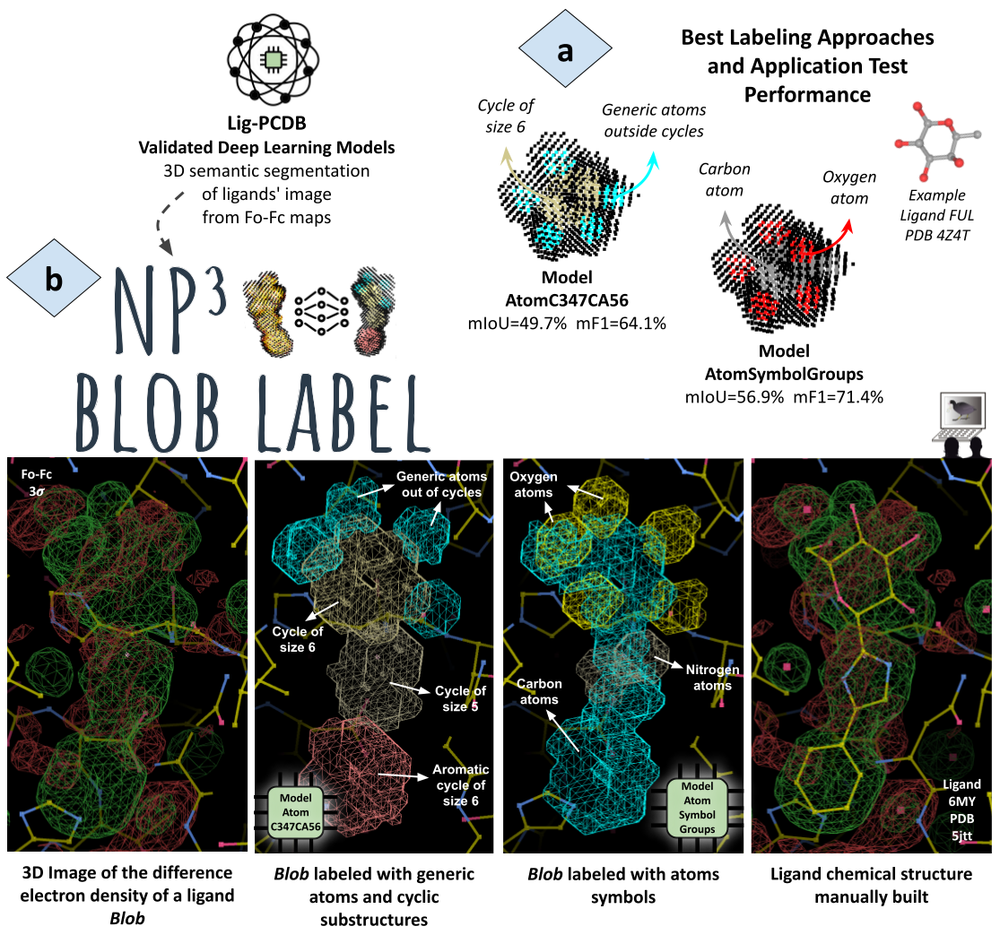
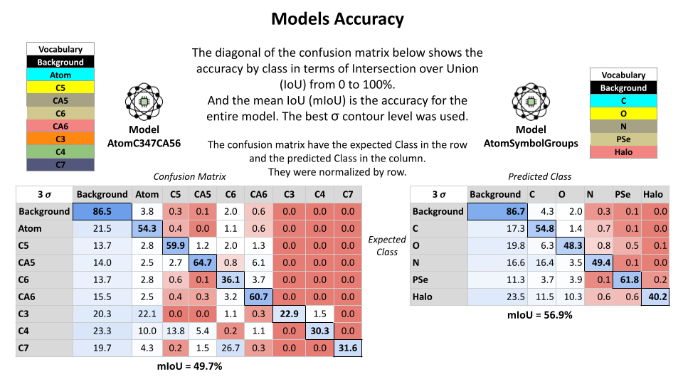
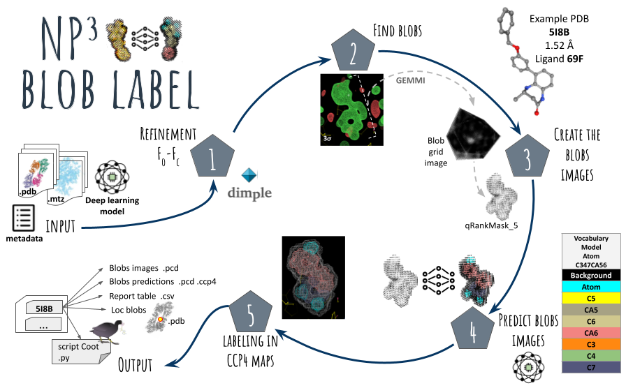

# NP³ Blob Label

--------------------------

  The NP³ Blob Label is a semi-automatic approach for ligand building tasks from Fo-Fc maps of X-ray protein crystallography based on deep learning. 

  This application is capable of finding new ligands sites in difference electron density maps, called blobs, and for each found blob the application will predict chemical substructures that fill and explain each part of the blob. The predictions serve as an initial proposal to help in the complete manual reconstructions of the ligand chemical structure, as illustrated below.



### How

----------------

  The deep learning semantic segmentation models were trained and validated with a dataset of **78911** ligands images from difference electron density of PDB entries in a resolution range between **1.5 Å** and **2.2 Å**. Data outside this resolution range may still be used in the NP³ Blob Label application, but the models accuracy (presented below) may not be reliable.

  The application will create an image of the blob from its difference electron density map and label this image. The blob image will be slight affected by the sigma contour level used in the search and the labels depends on the model used for the predictions. A schema of the application pipeline is illustrated next.

  The following models are available in the NP³ Blob Label repository and gave the better results:

- *Model AtomC347CA56* : Predicts generic atoms out of cycles, cycles with sizes from 3 to 7 and aromatic cycles with sizes 5 and 6
- *ModelAtomSymbolGroups* : Predicts the atoms symbols with groupings. The halo group with the halogen atoms (Cl, Br, I, F) and the PSe group with the minority atoms (P, S, Se)




### Application Pipeline Workflow

------------------------



## Getting Started

  Nine PDB entries from the stratified training dataset of Lig-PCDB with k=1 are used as example.
Their data is present in the 'examples_top_down' folder. A previous refinement result is also present.

  To execute the NP³ Blob Label to search for blobs in the entire Fo-Fc map of these nine entries, run:

```
conda activate np3_blob_label  # or alternativaly - conda activate np3_lig

python np3_blob_label.py --data_folder examples_top_down/ --refinement_path examples_top_down/refinement/ --entries_list_path examples_top_down/entries_list_top_down.csv 
--model_ckpt_path models/AtomC347CA56/modelAtomC347CA56_ligs-78911_img-qRankMask_5_gridspace-05_k1.ckpt --output_name modelAtomC347CA56 
```

  Alternatively, the application may be executed to search for blobs in their specific positions. An example with six blobs from six of the selected entries may be searched and labeled by running::

```
python np3_blob_label.py --data_folder examples_top_down/ --entries_list_path examples_top_down/entries_list_top_down_search_positions.csv --refinement_path examples_top_down/refinement/ --model_ckpt_path models/AtomC347CA56/modelAtomC347CA56_ligs-78911_img-qRankMask_5_gridspace-05_k1.ckpt --output_name modelAtomC347CA56_searchBlobPositions --search_blobs list
```

  At the end of the workflow the user may easily visualize the result of each entry with the *Python script created for Coot* (named 'prediction-blobs-view-coot.py'). This script can be executed by Coot to automatically open and visualize the inputs (.mtz and .pdb) of an entry along with the synthetic electron density maps of each segmented class of the found blobs. This script also loads the created .pdb file of the protein entry with dummy atoms centered at the position of each found blob, inserted into a new dummy chain of the structure (always the last chain). It may be executed as follow:
  
```
coot --script examples_top_down/np3_ligand_modelAtomC347CA56_20230428_16h19m06s/4rvn/prediction-blobs-view-coot.py --no-guano
```

  The user may browse the found blobs and visualize their predictions using Coot's atom navigation tool. The application result also contains a *report table* with all found blobs, their information (intensity, volume, score and position) and their predicted classes by size (number of labeled points in each class), which may help the user summarize the findings and prioritize further analysis. 

More information about the workflow inputs and results, can be found in the provided Usage Notes:

> [*Usage Notes*](docs/NP3_Blob_Label-Usage_Notes.pdf)


## Requirements

--------------------

- Ubuntu >= 14.04 (may also work with other Unix operating systems)
- CCP4 (with [Dimple](https://ccp4.github.io/dimple/))
- [Coot](https://www2.mrc-lmb.cam.ac.uk/personal/pemsley/coot/) - Crystallographic Object-Oriented Toolkit
- GCC >= 7.4.0
- Python >= 3.8 and packages
- Ubuntu packages:
  - build-essentials
  - libopenblas-dev
- For GPU compatibility: 
  - CUDA >= 10.1.243 and compatible with the CUDA version used for pytorch (e.g. if you use conda cudatoolkit=11.1, use CUDA=11.1 for MinkowskiEngine compilation)

## Installation

---------

First install the Ubuntu packages:

```
sudo apt install build-essential libopenblas-dev g++-7
```

The required python and packages for NP³ Blob Label can be installed with **anaconda + pip**, or on the **system + pip** directly. If you have any issues installing the packages, please report it on the github issue page.

The GPU compatibility is explained in the installation with anaconda + pip. 

In both cases the [Minkowski Engine](https://github.com/NVIDIA/MinkowskiEngine) package, used for the deep learning model training and prediction, is installed at the end with pip.

We recommend using the **Anaconda + pip** installation guide.

### Anaconda + pip

Two pip requirements files are provided to help in the installation. One have GPU compatibility and the other is for CPU only.

First, follow the [anaconda documentation](https://www.anaconda.com/products/distribution) to install anaconda on your computer.

We recommend setting the anaconda channel priority to flexible mode before creating the environment:
`conda config --set channel_priority true`

Create a conda environment with python 3.8 to encapsulate the installation, then activate the environment and install the openblas package:

```
conda create -n np3_blob_label python=3.8
conda activate np3_blob_label
conda install openblas-devel -c anaconda
```

#### CPU only

Next, install the rest of the python packages requirements with pip:

```
pip install -r requirements_np3_blob_label_cpu.txt
```

And finally install que Minkowski Engine package with pip:

```
pip install -U git+https://github.com/NVIDIA/MinkowskiEngine -v --no-deps --install-option="--blas=openblas" --install-option="--cpu_only"
```

#### GPU compatibility

Additional requirement:
- CUDA >= 10.1.243 and compatible with the CUDA version used for pytorch

The provided pip requirements files uses a pytorch compatible with CUDA>=11.1 and cuda-toolkit=11.1. For other CUDA versions please modify the corresponding requirements .txt file and the following cudatoolkit version. The pytorch CUDA version must match the cudtoolkit version.

Install the cudatoolkit=11.1 with conda:

```
conda install cudatoolkit=11.1 -c pytorch -c conda-forge 
```

Next, install the rest of the python packages requirements with pip, here [pytorch](https://pytorch.org/get-started/previous-versions/) compatible with CUDA=11.1 is being used:

```
pip install -r requirements_np3_blob_label_cuda11.1.txt -f https://download.pytorch.org/whl/torch_stable.html
```

And finally set the C++ compiler, set CUDA_HOME and install que Minkowski Engine with pip and the force_cuda parameter:

```
export CXX=g++-7;  # set this if you want to use a different C++ compiler
export CUDA_HOME=$(dirname $(dirname $(which nvcc))); # or select the correct cuda version on your system.
pip install -U git+https://github.com/NVIDIA/MinkowskiEngine -v --no-deps --install-option="--blas=openblas" --install-option="--force_cuda"
```

#### Clean the installation space

If you want to clean some space and remove the files downloaded by conda and pip in the installation, run:

```
pip cache purge
conda clean --all
```

### System python + pip

Install python 3.8 and some packages:

```
sudo apt install python3.8 
sudo apt install python3-dev python3-distutils python3-apt
```

Then, install git and pip:
```
sudo apt install git
# check if pip is installed:
#> python3 -m pip --version 
# if not installed than run:
python3 -m ensurepip --upgrade # install pip
# or
#> sudo apt install -f python3-pip # another option to install pip
```

Next, install the rest of the python packages requirements with pip:

```
pip install -r requirements_np3_blob_label_cpu.txt
```

And finally install que Minkowski Engine with pip:

```
pip install -U git+https://github.com/NVIDIA/MinkowskiEngine -v --no-deps --install-option="--blas=openblas" --install-option="--cpu_only"
```
