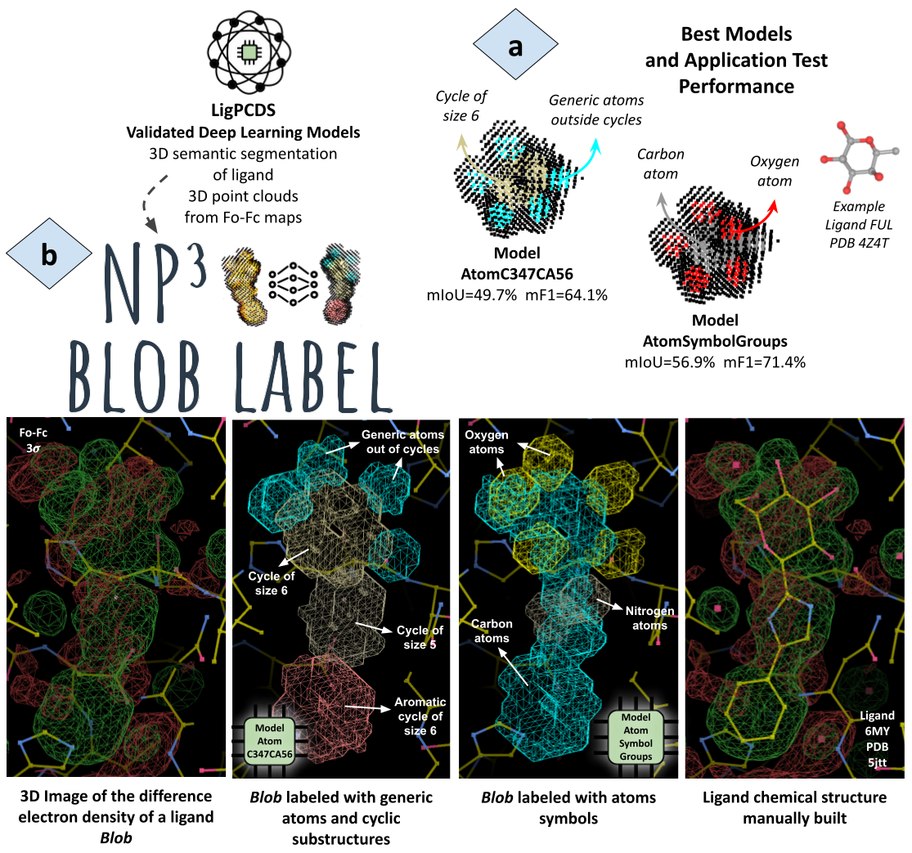
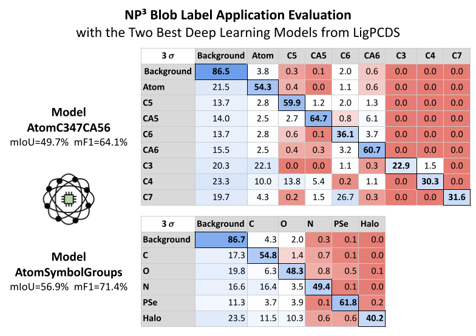
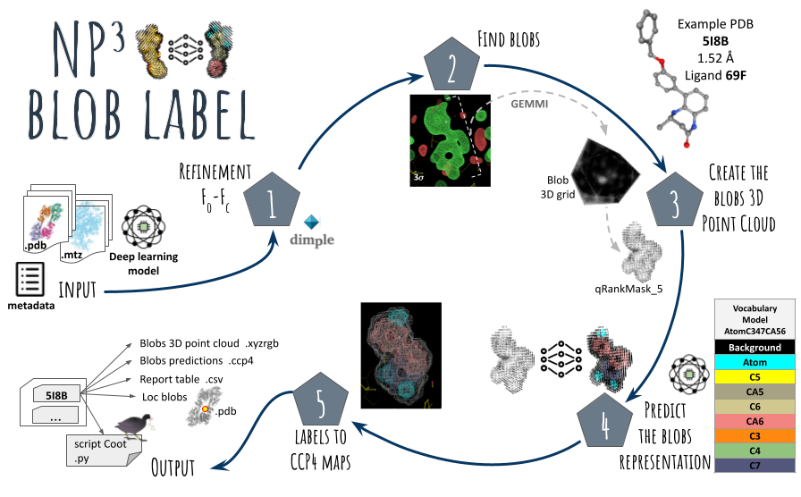
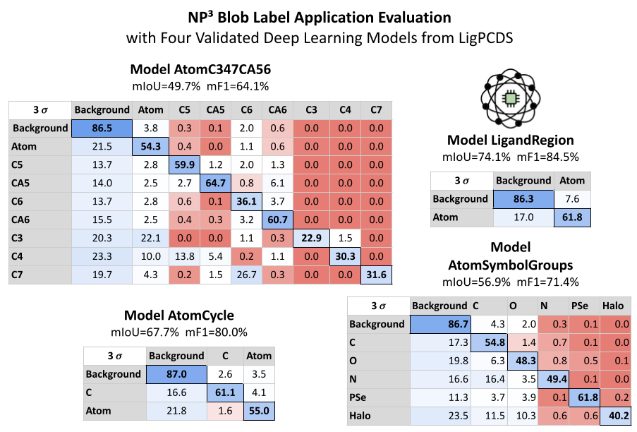

# NP³ Blob Label

#### Current Version: 2.0.0

New features:
- Compatibility with np3_LigPCDS and np3_DL_segmentation new codes version 2.0.0
- Added more documentation about testing this application result using LigPCDS data
- Installation instruction updated

--------------------------

  The NP³ Blob Label is a semi-automatic approach for ligand building tasks from Fo-Fc maps of X-ray protein crystallography based on deep learning. 

  This application is capable of finding new ligands sites in difference electron density maps, called blobs, and for each found blob the application will predict chemical substructures that fill and explain each part of the blob. The predictions serve as an initial proposal to help in the complete manual reconstructions of the ligand chemical structure, as illustrated below.



### How

----------------

  The deep learning semantic segmentation models were trained and validated with a dataset of **78911** ligand 3D point clouds from difference electron density of PDB entries in a resolution range between **1.5 Å** and **2.2 Å**. Data outside this resolution range may still be used in the NP³ Blob Label application, but the models accuracy (presented below) may not be reliable.

  The application will create a 3D point cloud of each blob from its difference electron density map and label this representation using the models prediction. The blob representation will be slight affected by the sigma contour level used in the search and the labels depends on the model used for the predictions. A schema of the application pipeline is illustrated next.

  The following models are available in the NP³ Blob Label repository and gave the best results:

- *Model AtomC347CA56* : Predicts generic atoms out of cycles, cycles with sizes from 3 to 7 and aromatic cycles with sizes 5 and 6
- *Model AtomSymbolGroups* : Predicts the atoms symbols with groupings. The halo group with the halogen atoms (Cl, Br, I, F) and the PSe group with the minority atoms (P, S, Se)




### Application Pipeline Workflow

------------------------



## Getting Started

  Nine ligand entries from the stratified training dataset of LigPCDS with k=1 are used as example.
Their data is present in the 'examples_top_down' folder. A previous refinement result is also present for their PDB entry.
The output result will be stored in the 'outs' folder.

  To execute the NP³ Blob Label to search for blobs in the entire Fo-Fc map of these nine entries, run:

```
conda activate np3_blob_label  # or alternativaly -> conda activate np3_lig

python np3_blob_label.py --data_folder examples_top_down/ --refinement_path examples_top_down/refinement/ --entries_list_path examples_top_down/entries_list_top_down_all.csv --model_ckpt_path models/AtomC347CA56/modelAtomC347CA56_ligs-78911_img-qRankMask_5_gridspace-05_k1.ckpt --output_name modelAtomC347CA56 --output_path outs/
```

  Alternatively, the application may be executed to search for blobs in their specific positions. An example with six blobs from six of the example entries may be searched and labeled by running:

```
python np3_blob_label.py --entries_list_path examples_top_down/entries_list_top_down_list.csv --refinement_path examples_top_down/refinement/ --model_ckpt_path models/AtomC347CA56/modelAtomC347CA56_ligs-78911_img-qRankMask_5_gridspace-05_k1.ckpt --output_name modelAtomC347CA56_searchBlobPositions --output_path outs/ --search_blobs list 
```

  At the end of the workflow, the user may easily visualize the result of each entry using the **Python script created for Coot** (named 'prediction-blobs-view-coot.py'). This script can be executed by Coot to automatically open and visualize the inputs (.mtz and .pdb) of an entry along with the synthetic electron density maps of each segmented class of the found blobs. This script also loads the created .pdb file of the protein entry with dummy atoms centered at the position of each found blob, inserted into a new dummy chain of the structure (always the last chain). It may be executed as follow:
  
```
coot --script outs/np3_blob_label_modelAtomC347CA56_<Date>/4rvn/prediction-blobs-view-coot.py --no-guano
```

  The user may browse the found blobs and visualize their predictions using Coot's atom navigation tool. The application result also contains a *report table* with all found blobs, their information (intensity, volume, score and position) and their predicted classes by size (number of labeled points in each class), which may help the user summarize the findings and prioritize further analysis. 

More information about the workflow inputs, results and overview can be found in the provided Usage Notes:

> [*Usage Notes*](docs/NP3_Blob_Label-Usage_Notes.pdf)


## Requirements

--------------------

- Ubuntu >= 20.04 (may also work with other Unix operating systems, but was not tested)
- CCP4 (with [Dimple](https://ccp4.github.io/dimple/))
- [Coot](https://www2.mrc-lmb.cam.ac.uk/personal/pemsley/coot/) - Crystallographic Object-Oriented Toolkit
- GCC >= 7.4.0 and GCC <= 10 (depends on the CUDA version)
- Python >= 3.9 and packages
- Ubuntu packages:
  - build-essentials
  - libopenblas-dev
- For GPU use enabled: 
  - CUDA >= 10.1.243 and recommended CUDA < 12
  - Compatible with the CUDA version used for [pytorch](https://pytorch.org/get-started/previous-versions/) (e.g. if you use conda cudatoolkit=11.8, use CUDA=11.8 for MinkowskiEngine compilation) and with the [GPU driver](https://docs.nvidia.com/deploy/cuda-compatibility/minor-version-compatibility.html).

## Installation

---------

Tested in a Linux with Ubuntu 22.02 and GPU Driver Version nvidia 535.274.02.

First install the Ubuntu packages:

```
sudo apt install build-essential libopenblas-dev g++-9
```

The required python and packages for NP³ Blob Label can be installed with **anaconda + pip**, or on the **system + pip** directly. If you have any issues installing the packages, please report it on the github issue page.

The GPU compatibility is explained in the installation with anaconda + pip. 

In both cases the [Minkowski Engine](https://github.com/NVIDIA/MinkowskiEngine) package, used for the deep learning model training and prediction, is installed at the end with pip.

We recommend using the **Anaconda + pip** installation guide.

### Anaconda + pip

Two pip requirements files are provided to help in the installation. One have GPU compatibility and the other is for CPU only.

First, follow the [anaconda documentation](https://www.anaconda.com/products/distribution) to install anaconda on your computer.

We recommend setting the anaconda channel priority to flexible mode before creating the environment:
`conda config --set channel_priority true`

Create a conda environment with python 3.9 to encapsulate the installation, then activate the environment, install the openblas package and another dependency of the open3d package:

```
conda create -n np3_blob_label python=3.9
conda activate np3_blob_label
conda install openblas-devel -c anaconda
conda install -c conda-forge libstdcxx-ng=13.2 
```

#### CPU only

Next, install the rest of the python packages requirements with pip:

```
pip install -r requirements_np3_blob_label.txt --extra-index-url https://download.pytorch.org/whl/cpu
```

And finally install que Minkowski Engine package from the github source code:

```
if [ ! -d 'lib/MinkowskiEngine' ]; then
  mkdir lib && cd lib
  git clone https://github.com/NVIDIA/MinkowskiEngine.git
  cd MinkowskiEngine
else
  cd lib/MinkowskiEngine
fi
python setup.py install --blas_include_dirs=${CONDA_PREFIX}/include:/usr/include/ --blas=openblas --cpu_only
cd ../..
```

#### GPU compatibility

Additional requirement:
- CUDA - compatible with the CUDA version used for pytorch

The provided pip requirements files uses a pytorch compatible with CUDA>=11.8 and cuda-toolkit=11.8. 
For other CUDA versions please modify the corresponding requirements .txt file and the following cuda-toolkit version. 
The pytorch CUDA version must match the cuda-toolkit version.

Install the cuda-toolkit=11.8 with conda and gcc=9.5:

```
conda install -c conda-forge gcc=9 gxx=9 -y
conda install -c "nvidia/label/cuda-11.8.0" cuda cuda-toolkit
```

Next, install the rest of the python packages requirements with pip, here [pytorch](https://pytorch.org/get-started/previous-versions/) compatible with CUDA=11.8 is being used:

```
pip install -r requirements_np3_blob_label.txt --extra-index-url https://download.pytorch.org/whl/cu118
```

And finally set the C++ compiler, set CUDA_HOME and install que Minkowski Engine from the github source code using the force_cuda parameter:

```
export CXX=g++-9;  # set this if you want to use a different C++ compiler
export CUDA_HOME=$(dirname $(dirname $(which nvcc))); # or select the correct cuda version on your system.
export LD_LIBRARY_PATH=$CUDA_HOME/lib:$LD_LIBRARY_PATH
export PATH=$CUDA_HOME/bin:$PATH 
export MAX_JOBS=2; # parallel compilation - prevent to much CPU assignment and process killed
if [ ! -d 'lib/MinkowskiEngine' ]; then
  mkdir lib && cd lib
  git clone https://github.com/NVIDIA/MinkowskiEngine.git
  cd MinkowskiEngine
else
  cd lib/MinkowskiEngine
fi
python setup.py install --blas_include_dirs=${CONDA_PREFIX}/include --blas=openblas --force_cuda
cd ../..
```

#### Clean the installation space

If you want to clean some space and remove the files downloaded by conda and pip in the installation, run:

```
pip cache purge
conda clean --all
```

## Application evaluation with all LigPCDS validated models

--------------------





## Testing the NP³ Blob Label Application against LigPCDS entries

---------------------------------------------------------------

The accuracy of this application is a little bit different from the models trained with LigPCDS. This happens because
the point clouds created by the application follow a slight different methodology. The difference is in the blobs position
and sizing of the grid point cloud and further representations. 

In LigPCDS the deposited atomic coordinates of the ligand entries were used to estimate their
center position and sizing and were used to compute the entries bounding box sizing and grid. 
In NP³ Blob Label, there is no atomic coordinates for an unmodelled blob, 
instead this app uses the blob center and sizing estimation to define the point cloud center and bounding box sizing, which affects
the grid point cloud creation and thus the final representations of the list of blobs. And, 
the sigma cutoff value will directly affect the blob sizing and thus the final representations.

With different input point clouds the models prediction
outputs different results. So there is a need of testing the accuracy of the LigPCDS models against the point clouds 
created by the NP³ blob label using different sigma cutoff values.

First, we must create the entries_list_path table with the expected columns to execute the NP³ Blob Label. This table must 
contain all the data from the stratified training dataset from LigPCDS. Start as follows:

1. Copy the stratified training dataset from LigPCDS to be used in the testing
2. Create in this table the following columns required by NP³ Blob Label and save it with the suffix "_blobLabel":
   - Column 'blobID' equals to column 'ligID'; 
   - Column 'refinement' equals to 0;
   - Column 'noHetatm' equals to 0; and
   - Column 'entryID' equals to column 'entry'
```
ligs = pd.read_csv("../np3_DL_segmentation/training_datasets/training_dataset_valid_ligands_undersampling_maxLigCode_1000_kfolds_13_gridspace_0.5_SP.csv")
ligs['blobID'] = ligs.ligID
ligs['refinement'] = 0
ligs['noHetatm'] = 0
ligs['entryID'] = ligs.entry
ligs.to_csv("../np3_DL_segmentation/training_datasets/training_dataset_valid_ligands_undersampling_maxLigCode_1000_kfolds_13_gridspace_0.5_SP_np3_blob_label.csv", index=False)
```
3. Use a previous refinement from LigPCDS entries and a previous structure labeling result (xyz directory)
4. Execute np3_blob_label with LigPCDS using a sigma cutoff value equal to 3 (most similar to qRank0.95 used in LigPCDS):
` python np3_blob_label.py --search_blobs list --output_name ligPCDS_1.5_2.2_SP --entries_list_path training_dataset_valid_ligands_undersampling_maxLigCode_1000_kfolds_13_gridspace_0.5_SP_blobLabel.csv --refinement_path data/refinement_LigPCDS --model_ckpt_path models/AtomC347CA56/modelAtomC347CA56_ligs-78911_img-qRankMask_5_gridspace-05_k13.ckpt --output_path outputs/ --num_workers 4 --parallel_cores 2 --sigma_cutoff 3 `
5. Then organize the NP³ Blob Label result following the LigPCDS format and naming formats using the script:
`python test/test_app_blobs_imgs_to_ligPCDS.py entries_list_path np3_blob_label_output_path new_output_path db_ligxyz_path`
6. Finally, run a testing of the LigPCDS models following the np3_DL_segmentation tutorials, using the new_output_path as the 'lig_pcds_path' and the
entries_list_path as the 'ligs_data_filepath' parameters.

Different sigma cutoff values may be used here. 
Values closer to 3 sigma will give better results, but will lead to fewer entries representation correctly created.
Smaller values <= 2.5 sigma may lead to more entries representation correctly created, but will
also lower the accuracy of the models, that's because the final representations will have more noise (need more memory to process) and
more difference to the point clouds from LigPCDS.

The NP³ Blob Label evaluation result using LigPCDS and different sigma cutoff values is presented in the [*Usage Notes*](docs/NP3_Blob_Label-Usage_Notes.pdf).

## Citing

_Paper in preparation to be published._

## License

LigPCDS: Labeled Dataset of X-ray Protein Ligand 3D Images in Point Clouds and Validated Deep Learning Models © 2023 by Cristina Freitas Bazzano, Luiz F. G. Alves, Guilherme P. Telles, Daniela B. B. Trivella is licensed under [CC BY 4.0](https://creativecommons.org/licenses/by/4.0/).
